# Java Modernization Concert Scan Guide

This guide walks you through the process of scanning a Java upgraded application repository using IBM Concert for vulnerability detection and analysis.

## Step-by-Step Guide

### Step 1: Set up GitHub repository personal token

To enable Concert to access your GitHub repositories, you need to create a Personal Access Token (PAT). Navigate to GitHub Settings > Developer settings > Personal access tokens and generate a new token with the necessary repository permissions.

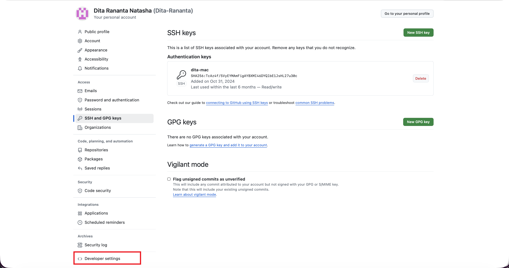

### Step 2: Choose Personal Token (Classic)

When creating your token, select "Personal Token (Classic)" option. Make sure to grant appropriate scopes such as `repo` access for full repository scanning capabilities.

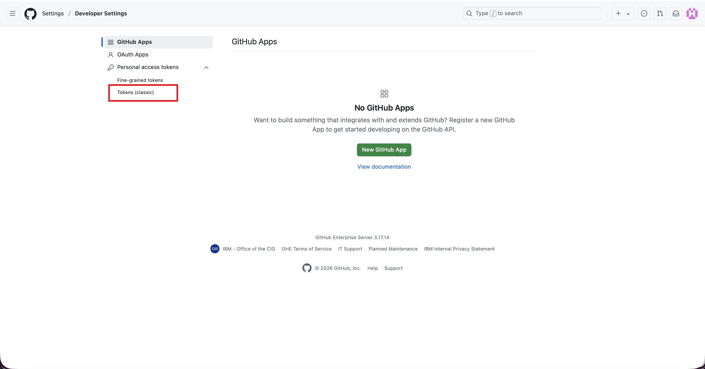

### Step 3: Open Concert environment

Launch the IBM Concert application and access the main dashboard. This is your starting point for configuring and managing application scans and vulnerability assessments.

See the env credentials here: 
```bash 
https://ibm.github.io/platinum-demos/ibm-concert-demo-environment/assets
```

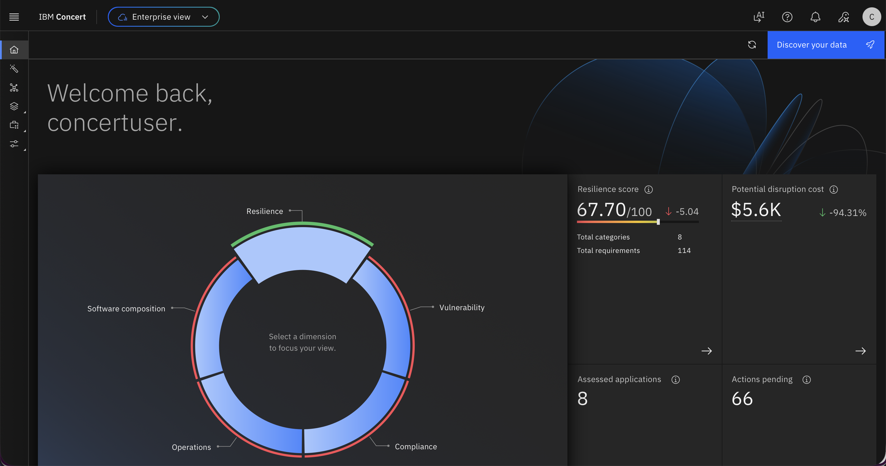

### Step 4: Choose Developer user

Select the Developer user role to access the development-focused features of Concert.

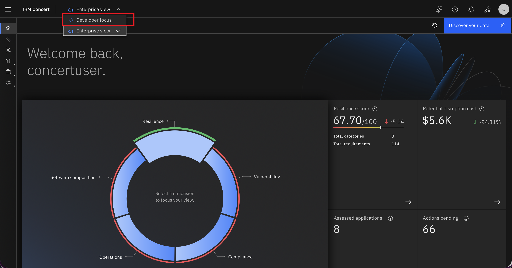

### Step 5: Choose Discovery Data

Navigate to the Discovery Data section where you can configure data sources for scanning. This is where you'll set up the connection to your GitHub repositories for automated discovery and analysis.

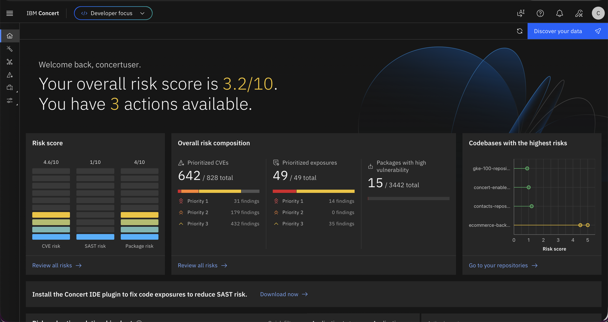

### Step 6: Concert will ask for the PAT (Personal Access Token)

Concert will prompt you to provide authentication credentials. This is where you'll need to enter the GitHub Personal Access Token you created in step 1 to authorize Concert to access your repositories.

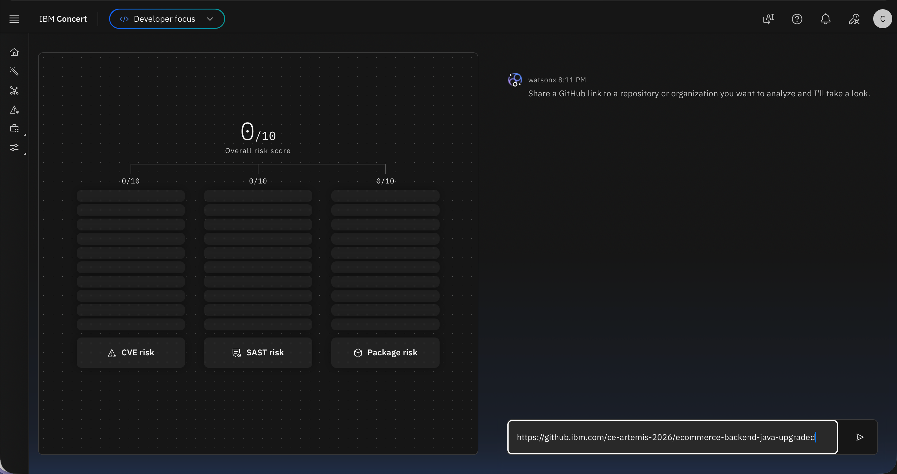

### Step 7: Enter the PAT in Concert

Paste the Personal Access Token you generated from GitHub into the designated field in Concert. This establishes a secure connection between Concert and your GitHub account, allowing the platform to access and scan your repositories.

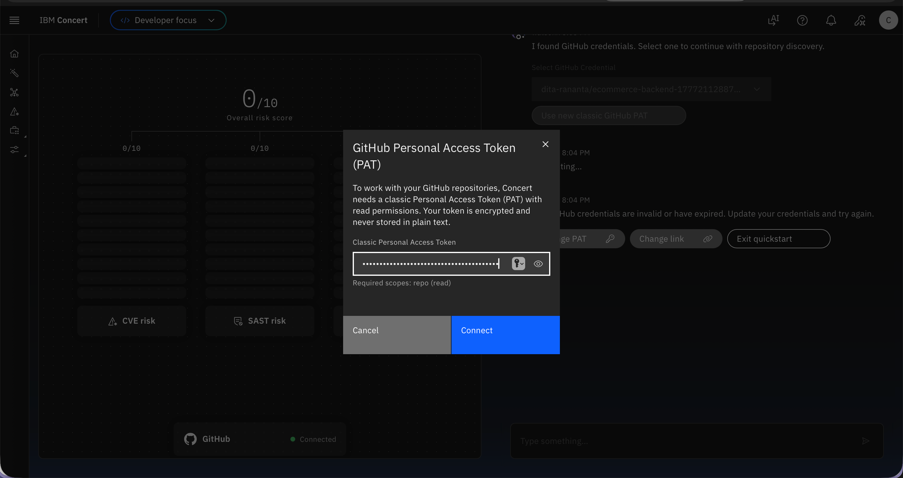

### Step 8: Enter the GitHub repository that needs to be scanned

Specify the GitHub repository URL or name that you want Concert to analyze. You can enter the full repository path (e.g., `username/repository-name`) to target a specific project for vulnerability scanning.

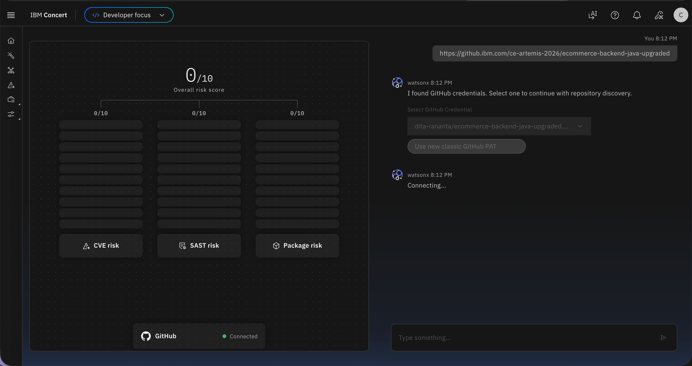

### Step 9: Concert will scan the repository

Once configured, Concert initiates the scanning process. It analyzes the repository's code, dependencies, and packages to identify potential security vulnerabilities, outdated libraries, and Common Vulnerabilities and Exposures (CVEs).

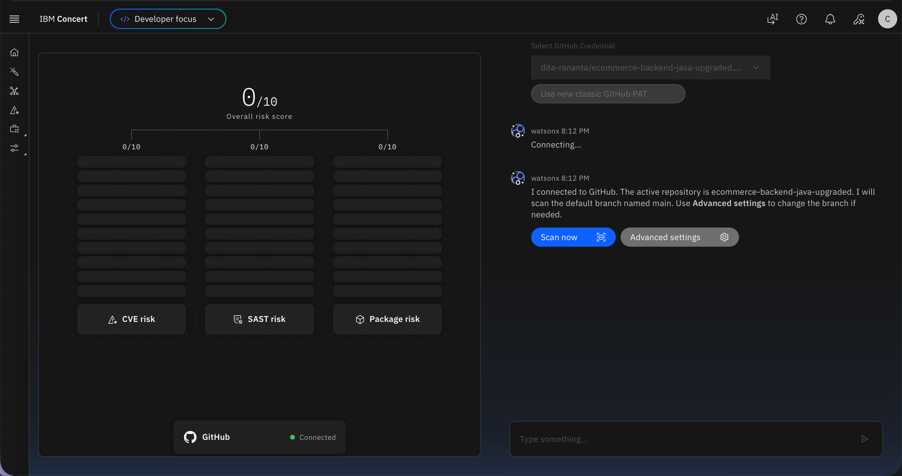

### Step 10: Go back to Enterprise view and choose Application Inventory

After the scan completes, navigate back to the Enterprise view in Concert. From there, select "Application Inventory" to see an overview of all scanned applications and their security status across your organization.

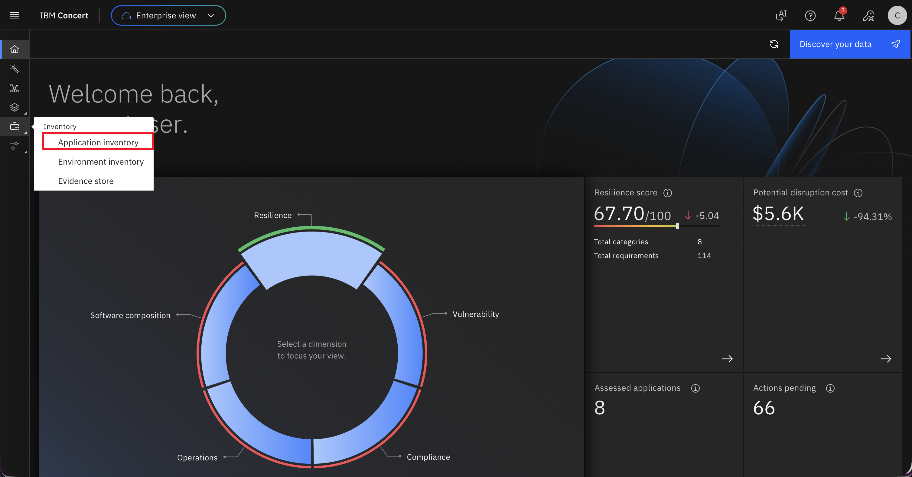

### Step 11: Select the GitHub repository

From the Application Inventory list, locate and select the specific GitHub repository you just scanned. This will display detailed information about the vulnerabilities and issues discovered in that particular application.

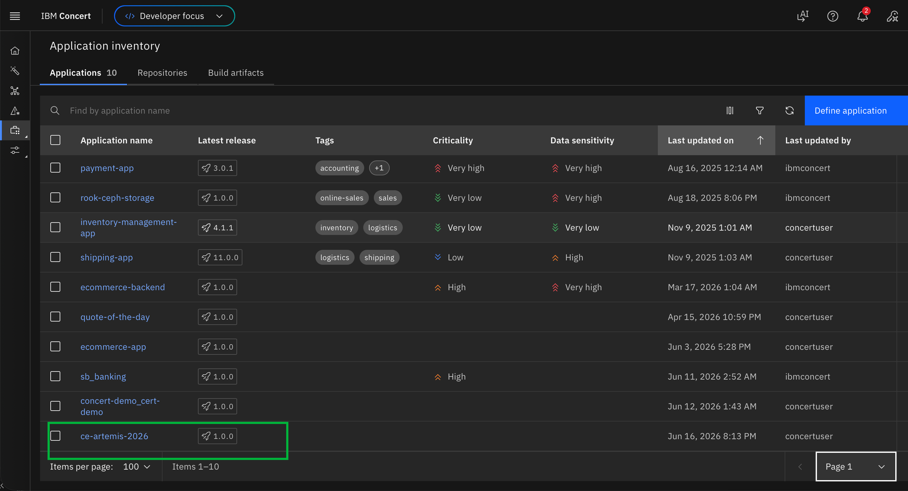

### Step 12: Concert finds vulnerability issues with Priority 1

Concert categorizes vulnerabilities by priority levels. Priority 1 issues are the most critical and require immediate attention. The system displays all high-priority vulnerabilities found in your application, including their severity ratings and potential impact.

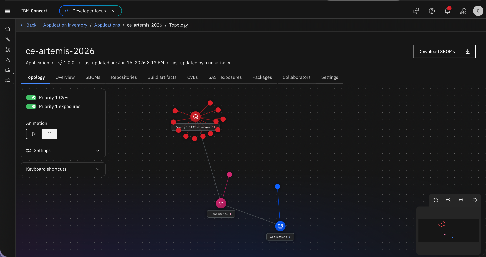

### Step 13: Check the vulnerabilities

Review the detailed list of vulnerabilities identified in your application. Each vulnerability entry includes information such as the CVE identifier, affected components, severity level, and a description of the security issue.

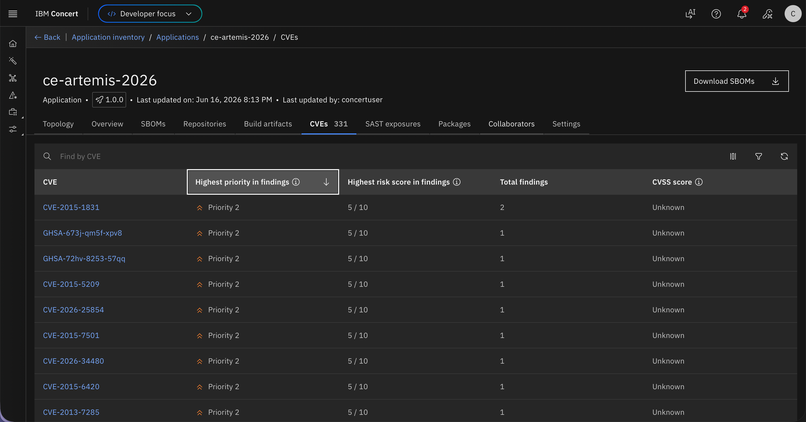

### Step 14: WatsonX integrated with Concert is also able to explain the vulnerability

IBM WatsonX AI integration provides intelligent explanations for each vulnerability. It offers context-aware insights, explains the potential security risks, and suggests remediation strategies in natural language, making it easier for developers to understand and address the issues.

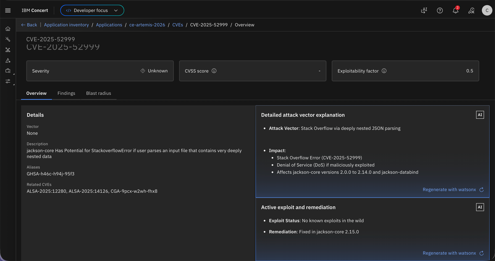

### Step 15: Concert can also map the vulnerability to the CVE in applications built with the same package

Concert's advanced mapping capabilities allow you to see how a specific vulnerability affects multiple applications across your organization. If multiple applications use the same vulnerable package or dependency, Concert identifies and correlates these instances, helping you prioritize remediation efforts across your entire application portfolio.

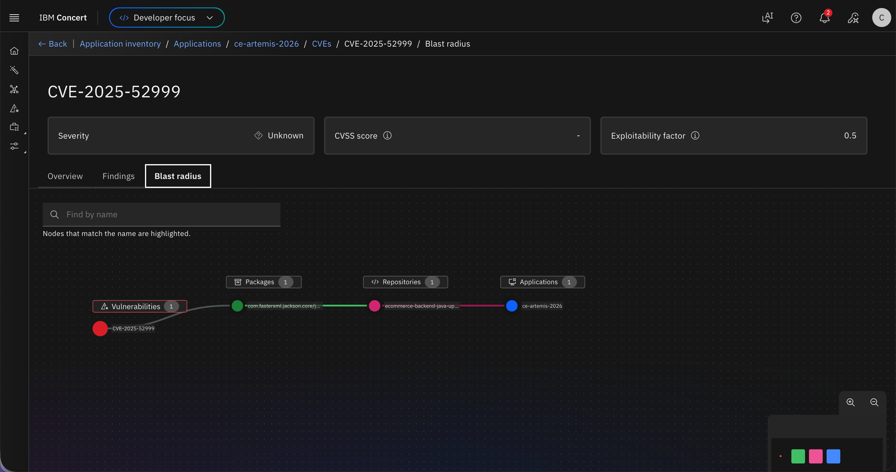

## Conclusion

Congratulations! You have successfully scanned your application using Concert and identified critical vulnerabilities.

## Next Steps
- Setup BOB modes for security remediation