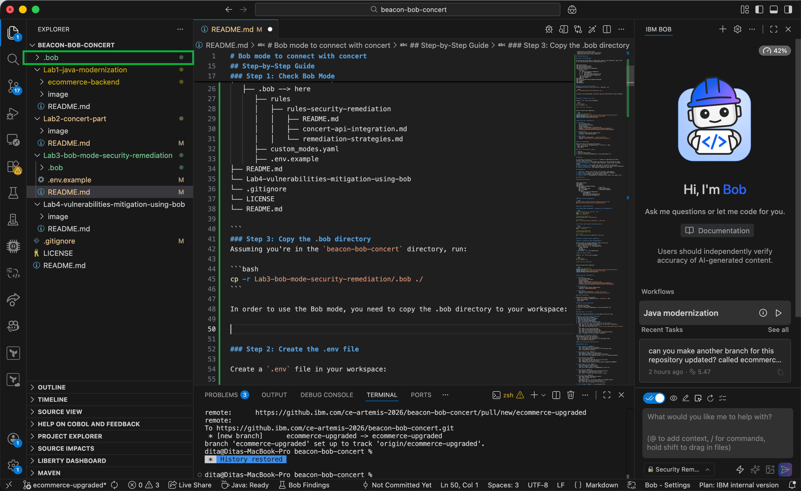

# Lab 3 — Bob Mode: Connect with IBM Concert

This guide walks you through setting up Bob's **Security Remediation** mode and connecting it to IBM Concert.

---

## 🔑 Workshop Credentials

> **Peserta Workshop:** 3 nilai di bawah akan dibagikan oleh presenter saat sesi ini dimulai. **Jangan di-commit ke GitHub!**

| Variable | Deskripsi |
|----------|-----------|
| `CONCERT_BASE_URL` | URL Concert instance + `/concert/core/api/v1` |
| `CONCERT_API_KEY` | API key dalam format base64 |
| `CONCERT_INSTANCE_ID` | Instance ID Concert (biasanya `0000-0000-0000-0000`) |

---

## Overview

Bob's Security Remediation mode memungkinkan kamu untuk:
- Terhubung ke IBM Concert dan mengambil data vulnerability
- Menganalisis CVE (dependency) dan SAST exposures (code-level)
- Mengusulkan dan mengaplikasikan security fixes
- Menjalankan tests untuk validasi fixes
- Mengupdate status vulnerability di Concert setelah remediation

---

## Step-by-Step Guide

### Step 1: Clone Repository

Clone repository `VulnerableSampleApp` ke local machine kamu:

```bash
git clone https://github.com/Client-Engineering-Indonesia/VulnerableSampleApp.git
cd VulnerableSampleApp
```

---

### Step 2: Copy `.bob` Directory ke Workspace

Bob membaca custom modes dari folder `.bob` di root workspace yang sedang kamu buka. Copy folder `.bob` dari repo workshop ini ke dalam folder `VulnerableSampleApp`:

```bash
# Dari dalam folder VulnerableSampleApp
cp -r ../Bob-Workshop-IBM-Indonesia/"Module 10 - Bob with IBM Concert"/Lab3-bob-mode-security-remediation/.bob ./
```

Atau kalau kamu clone workshop repo secara terpisah:

```bash
cp -r <path-to-workshop>/Lab3-bob-mode-security-remediation/.bob ./
```

Setelah dicopy, struktur folder kamu akan terlihat seperti ini:

```
VulnerableSampleApp/
├── .bob/                        ← ✅ baru dicopy
│   ├── custom_modes.yaml
│   └── rules/
│       └── rules-security-remediation/
│           ├── README.md
│           ├── concert-api-integration.md
│           └── remediation-strategies.md
├── VulnerableApp.java
└── pom.xml
```



---

### Step 3: Buat File `.env` dengan Credentials

Paste command berikut di terminal, **ganti 3 nilai** dengan credentials dari presenter:

```bash
cat > .env << EOF
CONCERT_BASE_URL=<ISI_DARI_PRESENTER>
CONCERT_API_KEY=<ISI_DARI_PRESENTER>
CONCERT_INSTANCE_ID=<ISI_DARI_PRESENTER>
EOF
```

Contoh hasil `.env` yang sudah terisi:

```bash
CONCERT_BASE_URL=https://your-concert-host:12443/concert/core/api/v1
CONCERT_API_KEY=Y29uY2VydHVzZXI6...
CONCERT_INSTANCE_ID=0000-0000-0000-0000
```

> ⚠️ File `.env` sudah ada di `.gitignore` — aman, tidak akan ke-push ke GitHub.

---

### Step 4: Reload Bob & Verifikasi Mode

Reload VS Code agar Bob membaca `custom_modes.yaml` yang baru dicopy:

- **Mac:** `Cmd+Shift+P` → ketik `Reload Window` → Enter
- **Windows/Linux:** `Ctrl+Shift+P` → ketik `Reload Window` → Enter

Setelah reload, buka Bob dan klik mode selector. Pastikan **🔒 Security Remediation** muncul di list:


---

### Step 5: Test Koneksi ke Concert

Pilih mode **🔒 Security Remediation**, lalu ketik di Bob:

```
Check Concert for vulnerabilities
```


Bob akan otomatis:
1. Membaca credentials dari `.env`
2. Test koneksi ke Concert API (`/kpis` endpoint)
3. Menampilkan semua aplikasi yang terdaftar di Concert

**Alur yang akan kamu lihat:**

Bob melakukan health check ke Concert:


Bob meminta approval untuk menjalankan curl command — klik **Approve**:


Bob mengkonfirmasi `.env` berhasil dibaca:


Koneksi berhasil — Concert API connected:


Bob menampilkan daftar aplikasi di Concert — kamu bisa melihat `VulnerableSampleApp`:


---

## ✅ Checklist Sebelum Lanjut ke Lab 4

- [ ] Folder `.bob` sudah ada di root `VulnerableSampleApp/`
- [ ] File `.env` sudah ada dengan 3 credentials terisi
- [ ] Mode **🔒 Security Remediation** muncul di Bob
- [ ] Bob berhasil connect ke Concert dan menampilkan daftar aplikasi

---

## Next Steps

Lanjut ke **[Lab 4 → Automated Vulnerability Remediation](../Lab4-vulnerabilities-mitigation-using-bob/README.md)**
