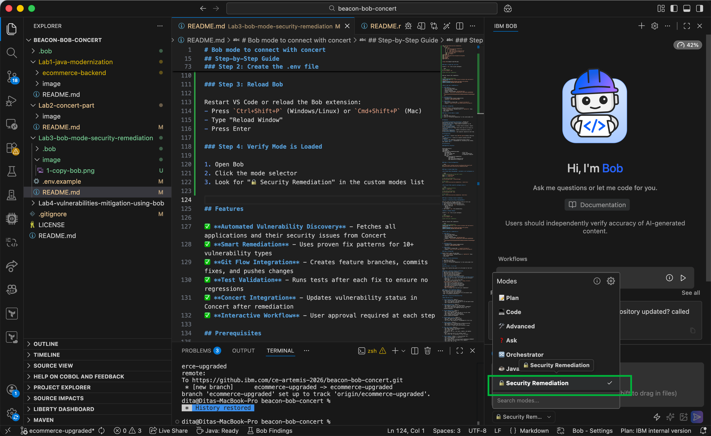
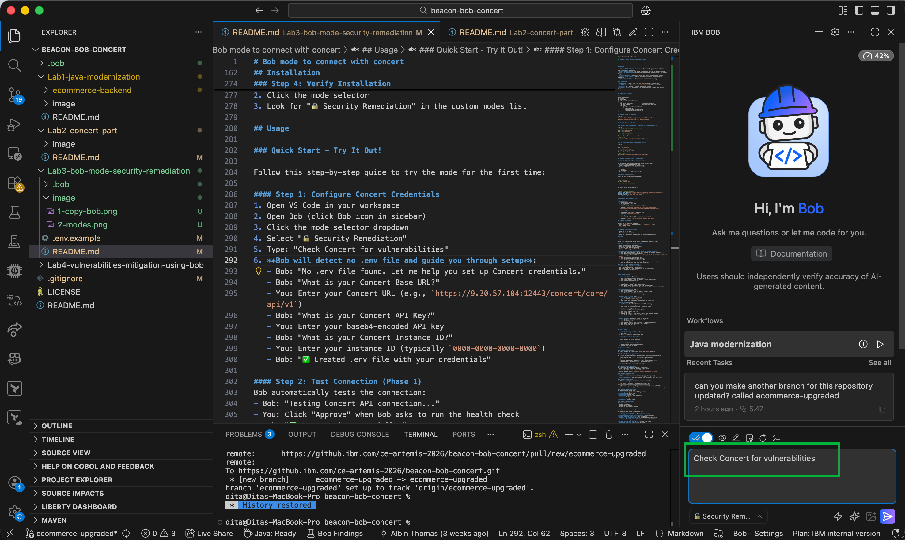
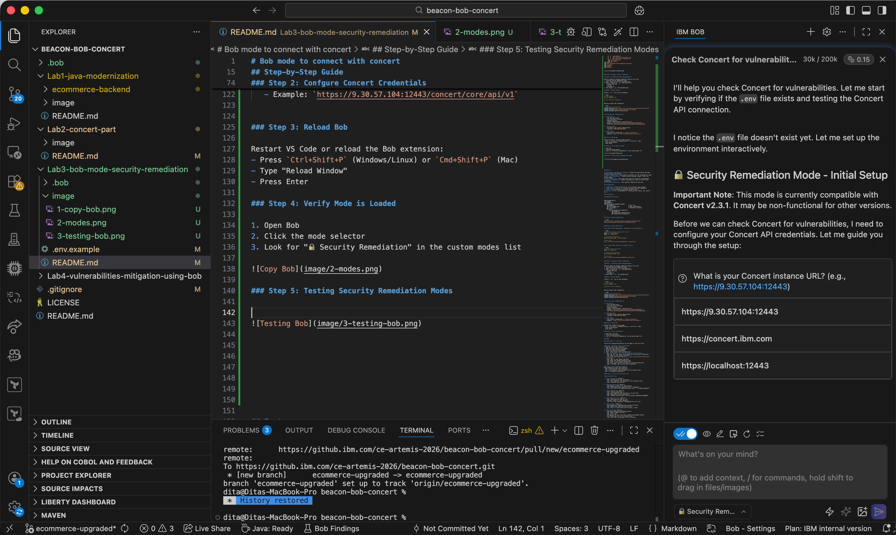
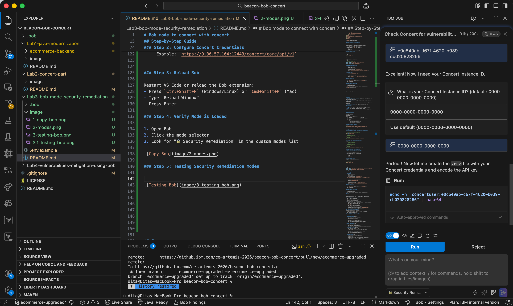
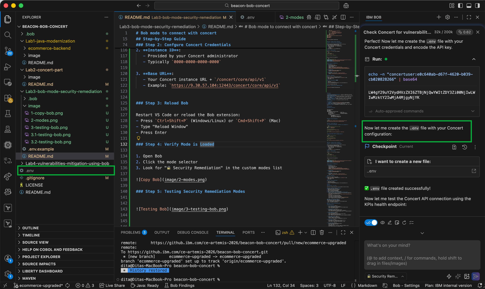
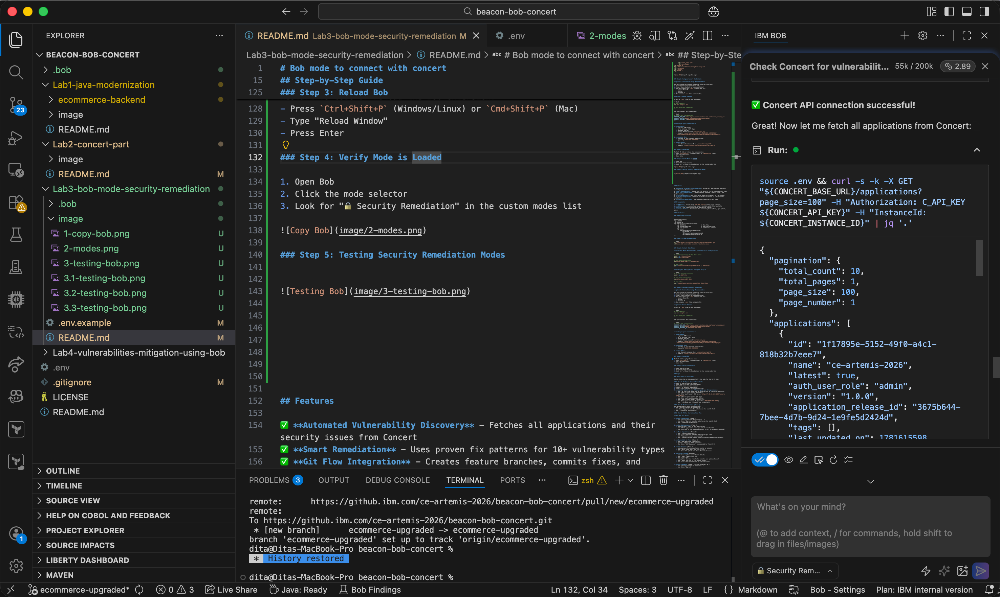
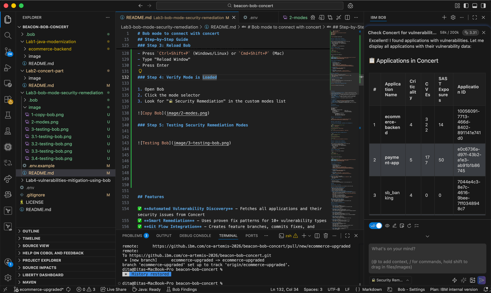

# Lab 3 — Setup Bob Security Remediation Mode

Hubungkan Bob ke IBM Concert dalam 4 langkah.

---

## 🔑 Workshop Credentials

> **Peserta:** 3 nilai di bawah akan dibagikan presenter saat sesi ini dimulai. **Jangan di-commit ke GitHub!**

| Variable | Deskripsi |
|----------|-----------|
| `CONCERT_BASE_URL` | URL Concert instance + `/concert/core/api/v1` |
| `CONCERT_API_KEY` | API key dalam format base64 |
| `CONCERT_INSTANCE_ID` | Instance ID Concert (biasanya `0000-0000-0000-0000`) |

---

## Step-by-Step

### Step 1: Buka Folder `Module 10` di VS Code

Buka VS Code, lalu:
- **File → Open Folder**
- Pilih folder `Module 10 - Bob with IBM Concert`
- Klik **Open**

> ✅ Folder `.bob` sudah tersedia di dalam folder ini — tidak perlu copy apapun.

---

### Step 2: Buat File `.env` dengan Credentials

Buka terminal di VS Code (`Ctrl+`` ` atau `Cmd+`` `), lalu paste command berikut. **Ganti 3 nilai** dengan credentials dari presenter:

```bash
cat > .env << EOF
CONCERT_BASE_URL=<ISI_DARI_PRESENTER>
CONCERT_API_KEY=<ISI_DARI_PRESENTER>
CONCERT_INSTANCE_ID=<ISI_DARI_PRESENTER>
EOF
```

Contoh hasil `.env` yang sudah terisi:
```
CONCERT_BASE_URL=https://your-concert-host:12443/concert/core/api/v1
CONCERT_API_KEY=Y29uY2VydHVzZXI6...
CONCERT_INSTANCE_ID=0000-0000-0000-0000
```

> ⚠️ File `.env` sudah ada di `.gitignore` — aman, tidak akan ke-push ke GitHub.

---

### Step 3: Reload VS Code

Agar Bob membaca `custom_modes.yaml` yang ada di folder `.bob`:

- **Mac:** `Cmd+Shift+P` → ketik `Reload Window` → Enter
- **Windows/Linux:** `Ctrl+Shift+P` → ketik `Reload Window` → Enter

---

### Step 4: Verifikasi Mode & Test Koneksi

1. Buka Bob, klik **mode selector**
2. Pastikan **🔒 Security Remediation** muncul di list



3. Pilih mode **🔒 Security Remediation**, lalu ketik:

```
Check Concert for vulnerabilities
```



Bob akan otomatis test koneksi dan menampilkan daftar aplikasi di Concert:



Klik **Approve** saat Bob meminta permission menjalankan curl:





Koneksi berhasil:



Daftar aplikasi di Concert muncul:



---

## ✅ Checklist Sebelum Lanjut ke Lab 4

- [ ] Folder `Module 10 - Bob with IBM Concert` terbuka di VS Code
- [ ] File `.env` sudah ada dengan 3 credentials terisi
- [ ] Mode **🔒 Security Remediation** muncul di Bob
- [ ] Bob berhasil connect ke Concert dan menampilkan daftar aplikasi

---

## Next Steps

Lanjut ke **[Lab 4 → Automated Vulnerability Remediation](../Lab4-vulnerabilities-mitigation-using-bob/README.md)**
