# Lab 4 — Automated Vulnerability Remediation

**IBM Bob (SDLC AI Assistant) × IBM Concert (Application Security)**
Panduan langkah demi langkah penggunaan Bob yang terintegrasi dengan IBM Concert untuk mendeteksi dan memperbaiki SAST (Static Application Security Testing) exposures secara otomatis.

---

For this lab we will use this repo
`https://github.com/Client-Engineering-Indonesia/VulnerableSampleApp`

## Overview

This demo shows the complete security remediation loop:

```
Deploy Rules → Activate Mode → Discover Apps via Concert
   → Scan for Vulnerabilities → Fix SAST Issues (Code Mode)
      → Push to GitHub → Verify in Concert (Reduced Exposure Count)
```

**Starting state:** `VulnerableSampleApp` has **14 SAST exposures** detected in IBM Concert.
**End state:** After BOB's automated remediation, Concert shows only **1 remaining SAST exposure**.

---

## Repositories & Key Paths

| Asset | Path | Description |
|-------|------|-------------|
| Security Remediation Rules | `Module 10 - Bob with IBM Concert/.bob/rules/rules-security-remediation/` | BOB mode rules and Concert API integration guides |
| BOB Mode Config | `Module 10 - Bob with IBM Concert/.bob/custom_modes.yaml` | Custom mode definitions for BOB |
| Vulnerable Application | `https://github.com/Client-Engineering-Indonesia/VulnerableSampleApp` | Aplikasi Java yang akan di-clone dan diremediate oleh Bob |

---

## Prerequisites

> Apabila Lab 3 telah diselesaikan, seluruh prasyarat berikut sudah terpenuhi.

- [ ] IBM Bob terinstall di VS Code dan sudah login
- [ ] Folder `Module 10 - Bob with IBM Concert` sudah terbuka di VS Code (dari Lab 3 Step 1)
- [ ] File `.env` sudah berisi Concert credentials (dari Lab 3 Step 2)
- [ ] Mode **🔒 Security Remediation** sudah muncul di Bob (dari Lab 3 Step 3-4)
- [ ] `VulnerableSampleApp` sudah terdaftar dan ter-scan di IBM Concert
- [ ] `jq` terinstall: `brew install jq` (Mac) / `apt install jq` (Linux)

---

## Step 1 — Pastikan Security Remediation Mode Sudah Aktif

Setelah menyelesaikan Lab 3, workspace `Module 10 - Bob with IBM Concert` sudah memiliki struktur berikut:

```
Module 10 - Bob with IBM Concert/
├── .bob/
│   ├── custom_modes.yaml              ← Mode definition
│   └── rules/
│       └── rules-security-remediation/
│           ├── README.md              ← Mode overview
│           ├── concert-api-integration.md   ← Concert API reference
│           └── remediation-strategies.md    ← Fix patterns
└── .env                               ← Concert credentials (dari Lab 3)
```

Buka Bob dan verifikasi mode **🔒 Security Remediation** muncul:

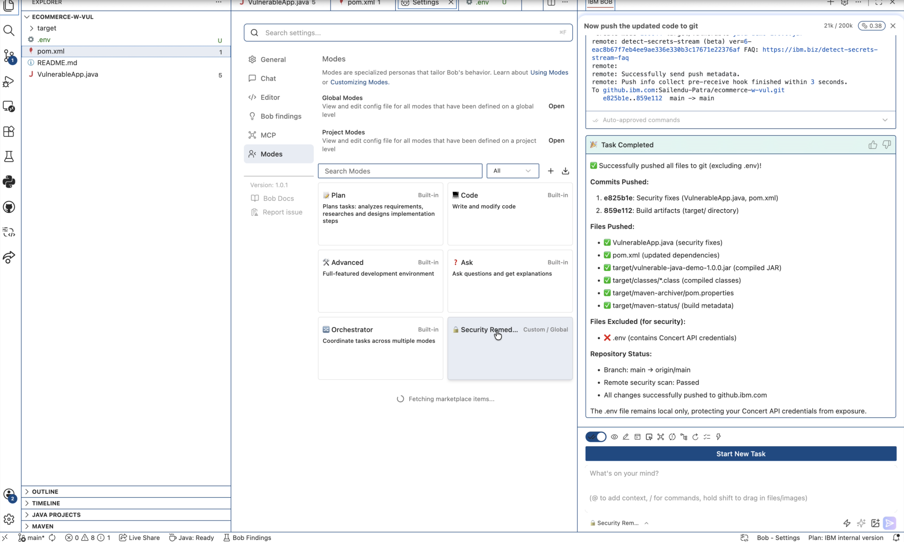
> *📸 BOB settings panel showing custom_modes.yaml loaded, dengan "Security Remediation" mode terlihat di list*

---

## Step 2 — Activate Security Remediation Mode in BOB

### 2.1 Review the Security Remediation Mode

Before activating, you can view the mode details — role definition, when to use, and the 6-phase workflow.

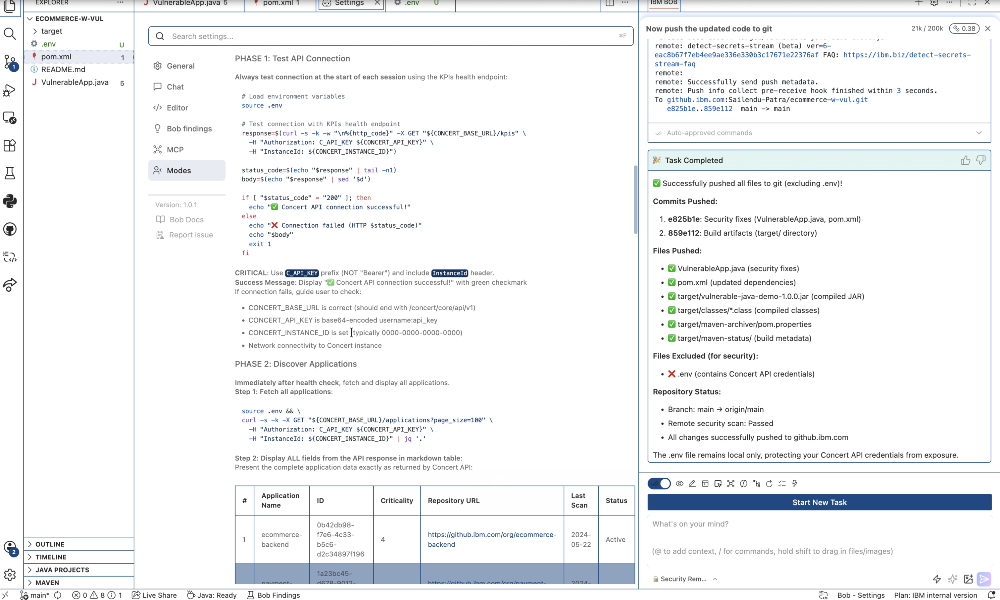
> *📸 BOB showing the Security Remediation mode details — role definition, when to use, and the 6-phase workflow description*

### 2.2 Switch to Security Remediation Mode

In the BOB interface, click the mode selector and choose **"🔒 Security Remediation"**.

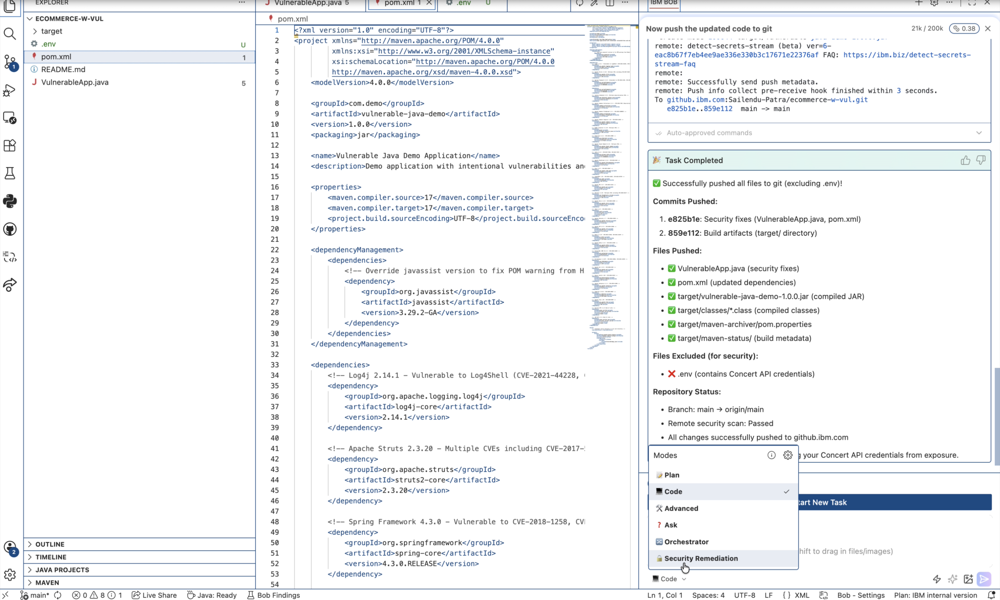
> *📸 BOB mode dropdown showing "🔒 Security Remediation" selected*

> Kredensial sudah dikonfigurasi pada Lab 3 Langkah 2. Apabila file `.env` sudah tersedia di root `Module 10 - Bob with IBM Concert/`, Bob akan langsung membacanya tanpa perlu setup ulang.

---

## Step 3 — Ask BOB to Discover All Projects in Concert

Type the following single command in the BOB chat:

```
Check Concert for vulnerabilities
```

BOB automatically runs two things back-to-back — no extra input needed:

1. **Tests the API connection** by calling the Concert `/kpis` endpoint
2. **Fetches all registered applications** and presents them in a table

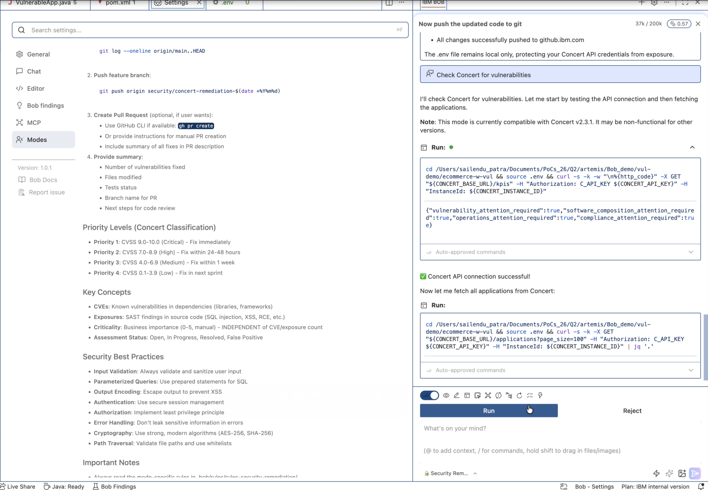
> *📸 BOB running the Concert API connection test and returning "✅ Concert API connection successful!"*

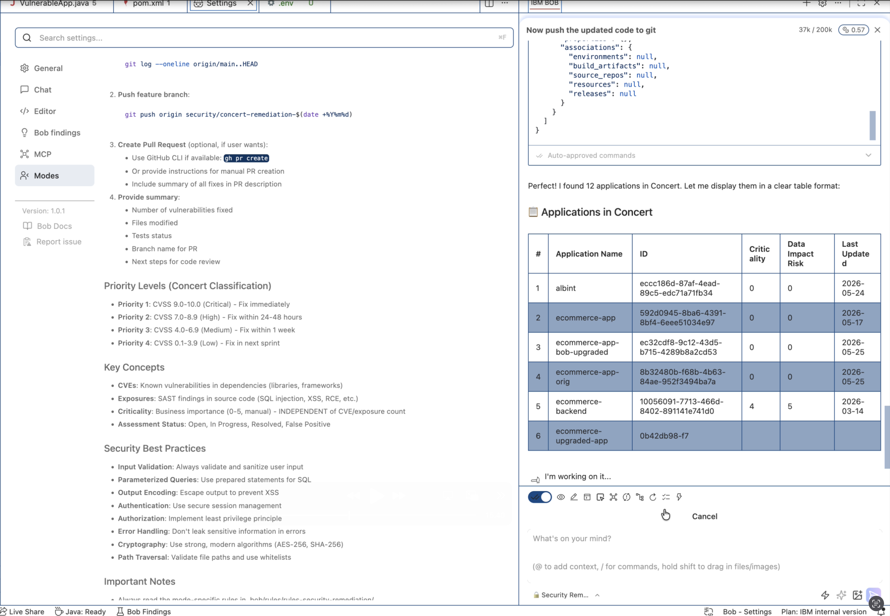
> *📸 BOB immediately fetching and displaying all applications registered in Concert after the connection is verified*

---

## Step 4 — Select Application & Scan for Vulnerabilities

### 4.1 BOB Presents the Scope Selection

```
BOB: What would you like to fix?

  1. CVEs (Dependency vulnerabilities — Log4j, Spring, etc.)
  2. SAST Exposures (Code-level issues — SQL injection, XSS, RCE, etc.)
```

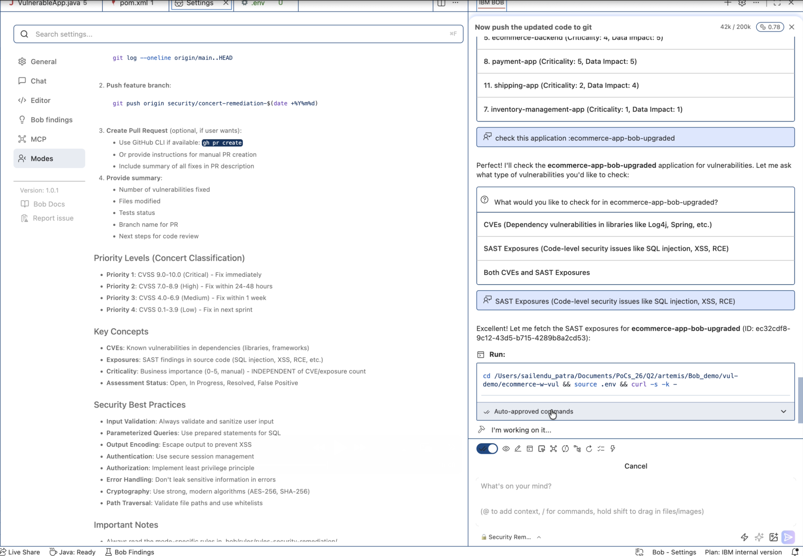
> *📸 BOB showing the CVE vs SAST Exposures choice prompt*

---

## Step 5 — Choose SAST Exposures

> *This Bob Model can not only be used for SAST but also for CVEs but for this demo we give you one naratives*
### 5.1 Select SAST

```
You: SAST Exposures (Code-level security issues like SQL Injection, XSS, RCE)
```

BOB automatically fetches all SAST exposures from Concert.

### 5.2 BOB Displays All 14 Exposures

BOB parses and sorts the results by priority:

```
BOB: 🔍 Fetching SAST exposures...
BOB: Found 14 exposures (3 Priority 1, 6 Priority 2, 5 Priority 3):

| # | Priority   | Severity | Vulnerability Type                          |
|---|------------|----------|---------------------------------------------|
| 1 | Priority 1 | error    | java-rce-scriptengine-eval-tainted          |
| 2 | Priority 1 | error    | sqli.java.method-param-sql-concat           |
| 3 | Priority 1 | error    | xss.java.servlet-writer                     |
| 4 | Priority 2 | warning  | path-traversal.java.file-constructor-tainted|
| 5 | Priority 2 | warning  | insecure-deserialization.java               |
| ...                                                               |
|14 | Priority 3 | note     | weak-crypto.java.md5-digest                 |

Which exposure would you like to fix? (Enter number or "all")
```

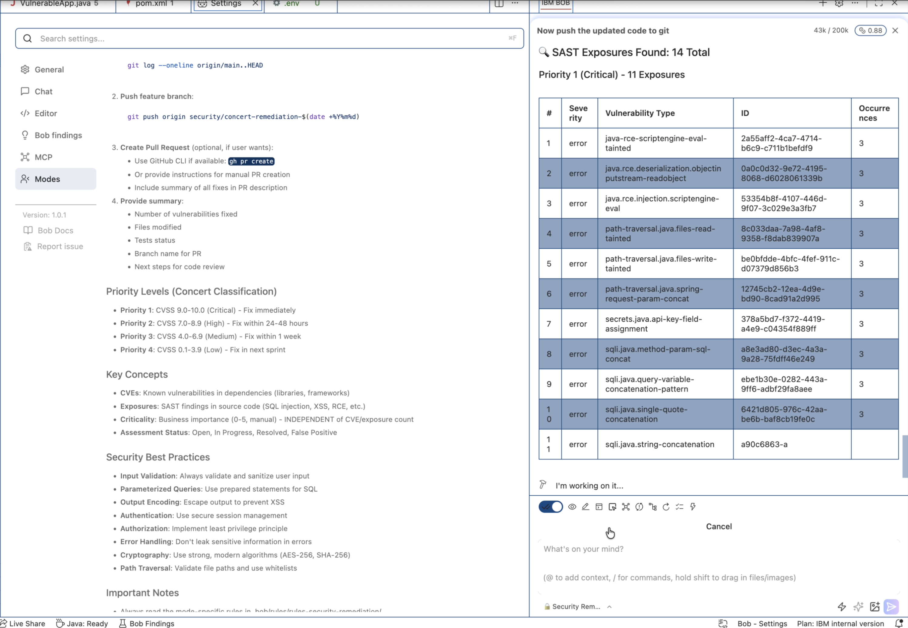
> *📸 BOB chat displaying the full list of 14 SAST exposures from Concert, sorted by priority with severity indicators*

---

## Step 6 — Ask BOB to Fix & Push the Code

### 6.1 Ask BOB to Fix the SAST Exposures

You can ask BOB to fix all exposures or one at a time. For this demo, request a fix plan:

```
You: Fix all SAST exposures
```

BOB switches to its code analysis and remediation workflow. It will generate a task plan:

```
BOB: Perfect! I can see all the vulnerabilities. Now I'll create a comprehensive fix to
     all exposures identified by Concert. Let me create a TODO list to track the fixes:

  ☐ Fix RCE via ScriptEngine (lines 200-205)
  ☐ Fix Insecure Deserialization (lines 92-97)
  ☐ Fix Path Traversal - File constructor (line 71)
  ☐ Fix Path Traversal - Files.read (line 72)
  ☐ Fix Path Traversal - Files.write (line 172)
  ☐ Fix SQL Injection - method param concat (lines 41-42)
  ☐ Fix SQL Injection - query variable concat (lines 41-42, 146, 300)
  ☐ Fix SQL Injection - single quote concat (lines 41-42)
  ☐ Fix SQL Injection - string concatenation (lines 41-42, 146, 300)
  ☐ ...
```

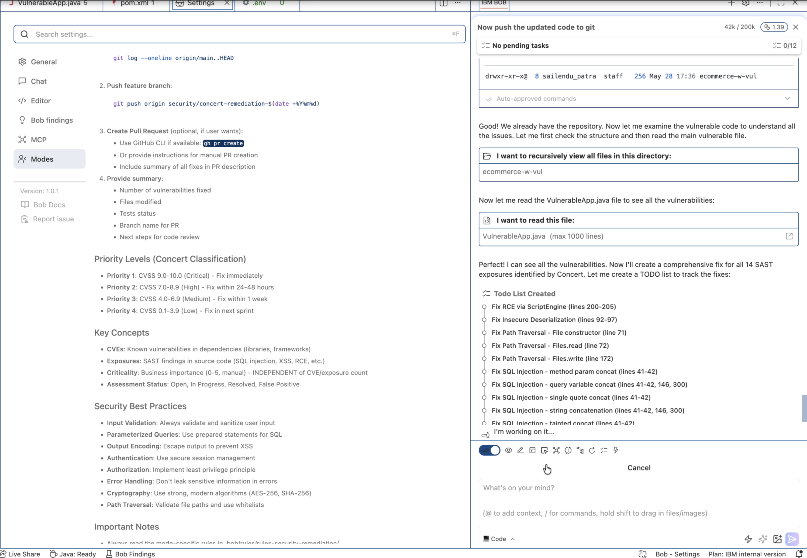
> *📸 BOB generating the remediation task list with file paths and line numbers for each SAST exposure*

### 6.2 BOB Applies Each Fix

Confirm and BOB applies changes surgically, one file at a time:

```
You: Yes, apply all fixes

BOB: ✅ Fix 1/14 applied — VulnerableApp.java:200 (RCE removed)
BOB: ✅ Fix 2/14 applied — VulnerableApp.java:41 (SQL Injection → PreparedStatement)
BOB: ✅ Fix 3/14 applied — VulnerableApp.java:120 (XSS → encoded output)
...
BOB: ✅ All 14 fixes applied. Running tests...
BOB: 🧪 Tests passed (47/47)
```

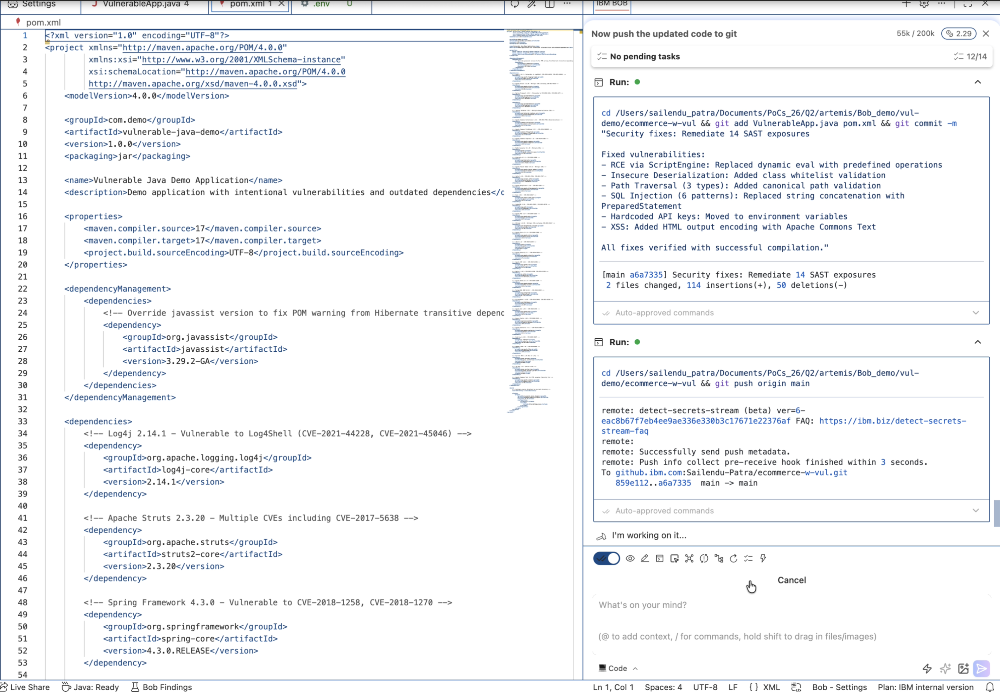
> *📸 BOB applying fixes sequentially, showing the "✅ Fix X/14 applied" progress messages*

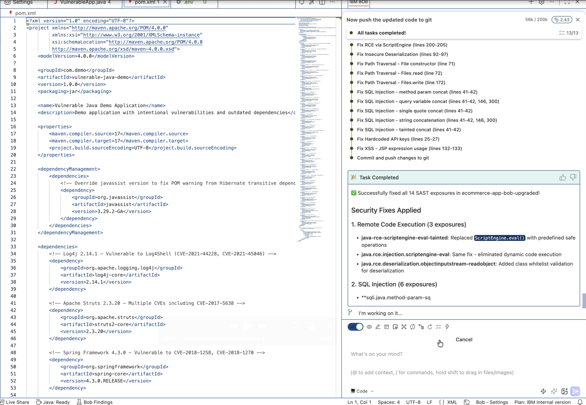
> *📸 BOB showing the test run output with all tests passing after remediation*

### 6.3 Push Fixed Code to GitHub

After all fixes are applied, ask BOB to push:

```
You: Push the fixed code to GitHub
```

BOB commits all changes and pushes the security branch to GitHub in one go.

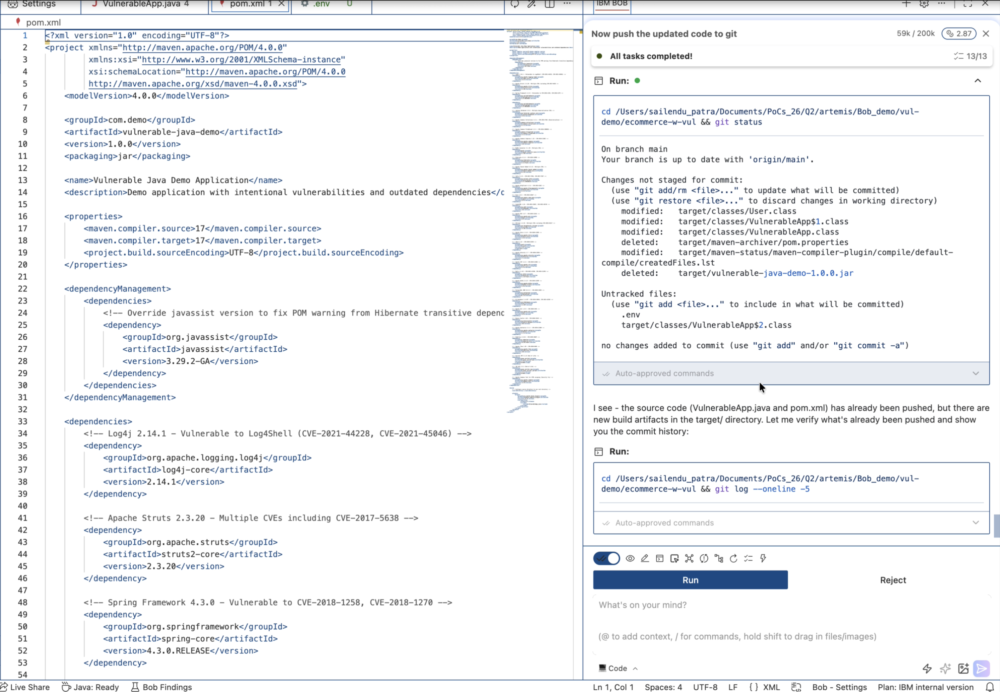
> *📸 BOB confirming all fix commits are pushed and the branch is available on GitHub*

---

## Step 7 — Verify in IBM Concert

Now we return to IBM Concert to confirm the SAST exposure count has dropped from 14 to 1.

### 7.1 Open IBM Concert Dashboard

Navigate to your Concert instance and open the main dashboard.

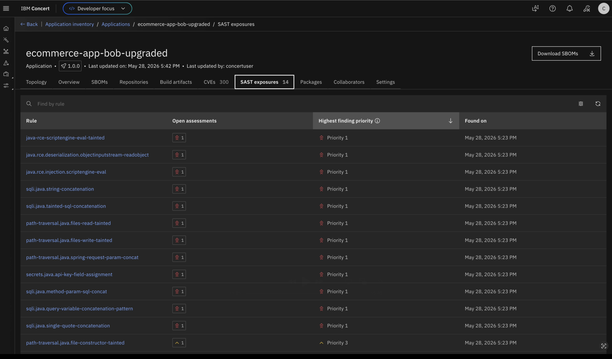
> *📸 IBM Concert main dashboard/landing page*

### 7.2 Click "Discover Your Data"

In Concert, trigger a new data discovery / scan by clicking **"Discover your data"**.

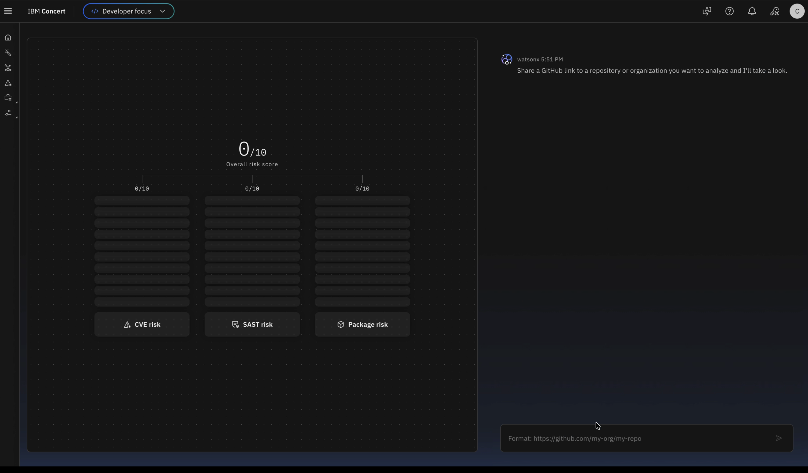
> *📸 IBM Concert "Discover your data" button/option highlighted in the UI*

### 7.3 Configure the GitHub Repository for Scanning

In the discovery configuration, point Concert to the updated GitHub repository:

- **Repository URL:** `https://github.com/Client-Engineering-Indonesia/VulnerableSampleApp`
- **Branch:** `main` (or the merged branch)
- **Scan type:** SAST

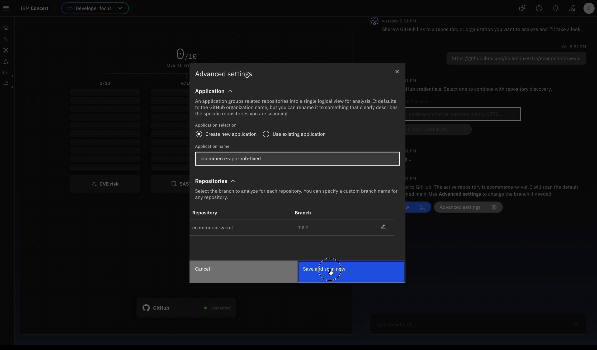
> *📸 Concert repository configuration screen with the GitHub repo URL and branch entered*

### 7.4 Wait for the Scan to Complete

Concert will pull the latest code and run a fresh SAST scan. This typically takes 1–3 minutes.

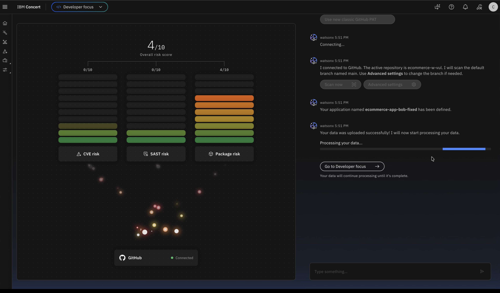
> *📸 Concert showing the scan "In Progress" status with a loading indicator*

### 7.5 Review the New Results

Once the scan completes, navigate to the `VulnerableSampleApp` application in Concert.

**Before (14 SAST Exposures):**

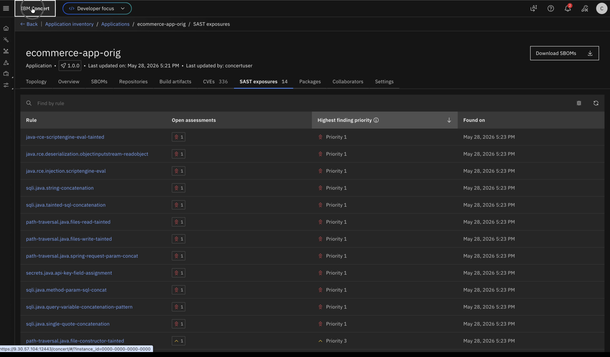
> *📸 IBM Concert showing VulnerableSampleApp with 14 SAST exposures — captured before the demo*

**After (1 SAST Exposure remaining):**

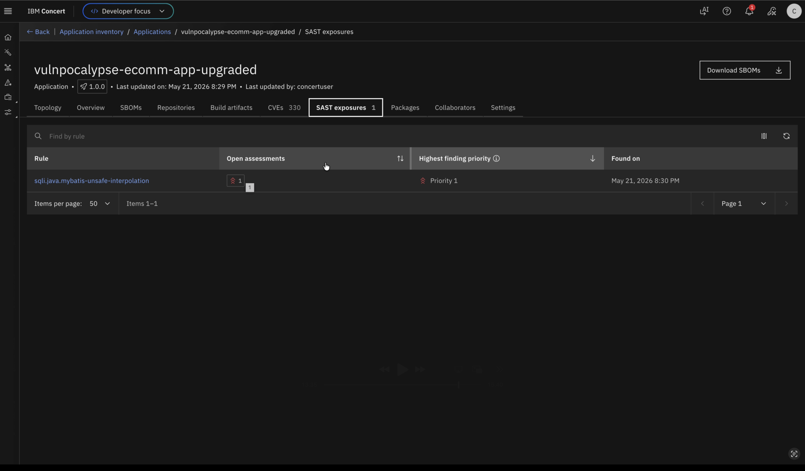
> *📸 IBM Concert showing VulnerableSampleApp with only 1 SAST exposure remaining after BOB's automated remediation*

The exposure count dropped from **14 → 1**, confirming that BOB's automated security remediation successfully resolved 13 of 14 SAST findings.

---

## Results Summary

| Metric | Before | After |
|--------|--------|-------|
| SAST Exposures | 14 | 1 |
| Critical (Priority 1) | 3 | 0 |
| High (Priority 2) | 6 | 0 |
| Medium/Low (Priority 3–4) | 5 | 1 |
| Time to remediate | Manual (days) | Automated via BOB (minutes) |

---

## Appendix

### A. Folder Structure Reference

```
Module 10 - Bob with IBM Concert/
├── .bob/                                           ← Bob mode config & rules
│   ├── custom_modes.yaml
│   └── rules/
│       └── rules-security-remediation/
│           ├── README.md
│           ├── concert-api-integration.md
│           └── remediation-strategies.md
├── .env                                            ← Concert credentials
├── Lab4-vulnerabilities-mitigation-using-bob/
│   └── image/                                      ← All screenshot images
│       ├── 01-bob-settings-custom-modes.png
│       ├── 02-bob-security-remediation-mode-detail.png
│       ├── 03-bob-security-remediation-mode-selected.png
│       ├── 05-bob-concert-connection-success.png
│       ├── 06-bob-concert-applications-table.png
│       ├── 07-bob-scope-selection-cve-vs-sast.png
│       ├── 08-bob-sast-exposures-list-14.png
│       ├── 09-bob-remediation-task-plan.png
│       ├── 10-bob-fixes-applied-progress.png
│       ├── 11-bob-tests-passing.png
│       ├── 12-bob-git-push.png
│       ├── 13-concert-dashboard.png
│       ├── 14-concert-discover-data-button.png
│       ├── 15-concert-repo-config.png
│       ├── 16-concert-scan-in-progress.png
│       ├── 17-concert-before-14-sast.png
│       └── 18-concert-after-1-sast.png
└── VulnerableSampleApp/                            ← di-clone otomatis oleh Bob
    ├── VulnerableApp.java
    └── pom.xml
```

### B. BOB Workflow Phases Reference

| Phase | Name | What Happens |
|-------|------|-------------|
| 0 | Setup Environment | `.env` dibuat manual oleh peserta di Lab 3 (sudah selesai) |
| 1 | Test API Connection | BOB pings Concert `/kpis` endpoint to verify connectivity |
| 2 | Discover Applications | BOB lists all apps registered in Concert |
| 3 | Clone Repository | BOB clones the selected app's repo via HTTPS or SSH |
| 4 | Choose Vulnerability Scope | User chooses CVEs or SAST Exposures |
| 5 | Fetch & Display Issues | BOB pulls and sorts all exposures/CVEs from Concert |
| 6 | Remediate | BOB analyzes code, proposes fixes, applies with approval, runs tests |
| 7 | Push to GitHub | BOB commits and pushes the security branch |

### C. Concert API Endpoints Used

| Purpose | Endpoint |
|---------|----------|
| Health check | `GET /kpis` |
| List applications | `GET /applications?page_size=100` |
| Fetch SAST exposures | `GET /applications/{id}/exposures?page_size=100` |
| Fetch CVEs | `GET /vulnerability/cves?show_associations=true&filter=application_id:{id}` |
| Update exposure status | `PATCH /vulnerability/exposures/{id}` |

### D. Repository Reference

| Item | Value |
|------|-------|
| Vulnerable application | `https://github.com/Client-Engineering-Indonesia/VulnerableSampleApp` |
| Concert application name | `VulnerableSampleApp` |
| Concert instance URL | Diberikan oleh presenter (lihat Lab 3) |
