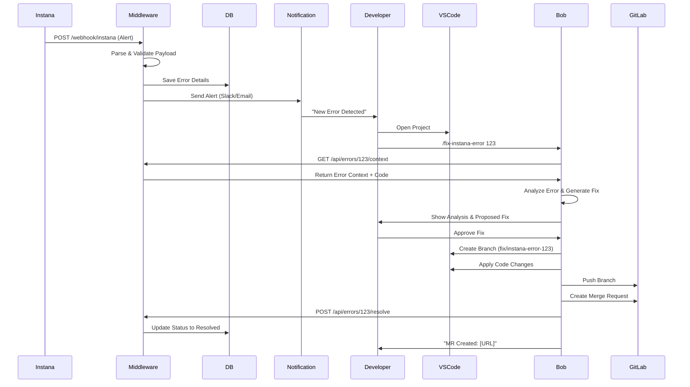

# 🤖 Instana-Bob-GitLab Integration Plan

## 📋 Executive Summary

Dokumen ini berisi rencana lengkap untuk mengintegrasikan **IBM Instana** (monitoring), **Bob AI** (VS Code assistant), dan **GitLab** untuk membuat sistem automated error detection dan fixing.

**Tujuan**: Ketika Instana mendeteksi error di production, sistem akan:
1. Menerima alert dari Instana
2. Menyimpan error details
3. Notifikasi developer
4. Developer trigger Bob untuk analisis
5. Bob generate fix dan create Merge Request otomatis

---

## 🏗️ Arsitektur Sistem (Opsi 3: Hybrid Manual-Trigger)

### Flow Diagram

```
┌─────────────┐
│   INSTANA   │ (Monitoring & Alert Detection)
└──────┬──────┘
       │ Webhook (HTTPS)
       ▼
┌─────────────────────────────────────────┐
│      MIDDLEWARE SERVICE                 │
│  - Webhook Handler                      │
│  - REST API                             │
│  - Notification Service                 │
└──────┬──────────────────┬───────────────┘
       │                  │
       ▼                  ▼
┌─────────────┐    ┌──────────────┐
│  DATABASE   │    │ NOTIFICATION │
│ (PostgreSQL)│    │ (Slack/Email)│
└─────────────┘    └──────┬───────┘
                          │
                          ▼
                   ┌──────────────┐
                   │  DEVELOPER   │
                   └──────┬───────┘
                          │
                          ▼
                   ┌──────────────┐
                   │   VS CODE    │
                   │  + BOB AI    │
                   └──────┬───────┘
                          │
                          ▼
                   ┌──────────────┐
                   │   GITLAB     │
                   │ (Repository) │
                   └──────────────┘
```

### Sequence Diagram



---

## 🔧 Komponen yang Diperlukan

### 1. Middleware Service
**Teknologi**: Node.js/Python/Go
**Fungsi**:
- Menerima webhook dari Instana
- Parse dan validate payload
- Simpan error details ke database
- Kirim notifikasi ke developer
- Provide REST API untuk Bob

**Endpoints**:
- `POST /webhook/instana` - Terima webhook
- `GET /api/errors` - List errors
- `GET /api/errors/:id` - Detail error
- `GET /api/errors/:id/context` - Full context untuk Bob
- `POST /api/errors/:id/resolve` - Mark resolved
- `GET /api/stats` - Statistics
- `GET /health` - Health check

### 2. Database
**Teknologi**: PostgreSQL 14+ atau MongoDB 6+

**Tables/Collections**:
- `errors` - Main error records
- `stack_traces` - Stack trace details
- `error_logs` - Application logs
- `request_contexts` - HTTP request details
- `code_contexts` - Code snapshots
- `fix_attempts` - Fix history
- `notifications` - Notification tracking

### 3. Notification System
**Channels**:
- Slack (Primary)
- Email (Fallback)
- Microsoft Teams (Optional)
- Telegram (Optional)

### 4. Bob AI Extension
**Capabilities**:
- Fetch error dari middleware API
- Analyze code dan error context
- Generate fix proposals
- Create git branch
- Apply code changes
- Create GitLab Merge Request

**Custom Command**:
```
/fix-instana-error <error_id>
```

### 5. GitLab Integration
**Requirements**:
- GitLab Personal Access Token
- Scopes: `api`, `write_repository`, `read_repository`
- GitLab API v4
- SSH/HTTPS access ke repository

---

## 📊 Database Schema

### PostgreSQL Schema

```sql
-- Main errors table
CREATE TABLE errors (
    id SERIAL PRIMARY KEY,
    instana_alert_id VARCHAR(255) UNIQUE NOT NULL,
    instana_incident_id VARCHAR(255),
    
    -- Timestamps
    created_at TIMESTAMP DEFAULT CURRENT_TIMESTAMP,
    triggered_at TIMESTAMP NOT NULL,
    first_seen TIMESTAMP,
    last_seen TIMESTAMP,
    resolved_at TIMESTAMP,
    
    -- Error details
    severity VARCHAR(20) NOT NULL,
    status VARCHAR(20) DEFAULT 'new',
    error_type VARCHAR(255) NOT NULL,
    error_message TEXT NOT NULL,
    error_count INTEGER DEFAULT 1,
    
    -- Service info
    service_name VARCHAR(255) NOT NULL,
    service_type VARCHAR(50),
    environment VARCHAR(50),
    host VARCHAR(255),
    
    -- Code location
    file_path TEXT NOT NULL,
    line_number INTEGER NOT NULL,
    method_name VARCHAR(255),
    class_name VARCHAR(255),
    
    -- Repository info
    repository_url TEXT NOT NULL,
    branch VARCHAR(255) NOT NULL,
    commit_hash VARCHAR(40) NOT NULL,
    commit_message TEXT,
    commit_author VARCHAR(255),
    
    -- Resolution info
    resolved_by VARCHAR(255),
    merge_request_url TEXT,
    fix_branch VARCHAR(255),
    fix_commit_hash VARCHAR(40),
    
    -- Metrics
    error_rate DECIMAL(5,4),
    response_time_p95 INTEGER,
    throughput INTEGER,
    
    -- URLs
    instana_url TEXT,
    
    -- Indexes
    INDEX idx_status (status),
    INDEX idx_severity (severity),
    INDEX idx_service (service_name),
    INDEX idx_created_at (created_at)
);

-- Stack traces table
CREATE TABLE stack_traces (
    id SERIAL PRIMARY KEY,
    error_id INTEGER REFERENCES errors(id) ON DELETE CASCADE,
    line_number INTEGER NOT NULL,
    content TEXT NOT NULL
);

-- Logs table
CREATE TABLE error_logs (
    id SERIAL PRIMARY KEY,
    error_id INTEGER REFERENCES errors(id) ON DELETE CASCADE,
    timestamp TIMESTAMP NOT NULL,
    level VARCHAR(20) NOT NULL,
    message TEXT NOT NULL,
    stack_trace TEXT
);

-- Request context table
CREATE TABLE request_contexts (
    id SERIAL PRIMARY KEY,
    error_id INTEGER REFERENCES errors(id) ON DELETE CASCADE,
    method VARCHAR(10),
    path TEXT,
    headers JSONB,
    body JSONB
);

-- Code context table
CREATE TABLE code_contexts (
    id SERIAL PRIMARY KEY,
    error_id INTEGER REFERENCES errors(id) ON DELETE CASCADE,
    file_path TEXT NOT NULL,
    start_line INTEGER NOT NULL,
    end_line INTEGER NOT NULL,
    content TEXT NOT NULL,
    language VARCHAR(50)
);

-- Fix attempts table
CREATE TABLE fix_attempts (
    id SERIAL PRIMARY KEY,
    error_id INTEGER REFERENCES errors(id) ON DELETE CASCADE,
    attempted_at TIMESTAMP DEFAULT CURRENT_TIMESTAMP,
    attempted_by VARCHAR(255) NOT NULL,
    fix_description TEXT,
    changes_applied TEXT,
    branch_name VARCHAR(255),
    commit_hash VARCHAR(40),
    merge_request_url TEXT,
    status VARCHAR(20),
    notes TEXT
);

-- Notifications table
CREATE TABLE notifications (
    id SERIAL PRIMARY KEY,
    error_id INTEGER REFERENCES errors(id) ON DELETE CASCADE,
    sent_at TIMESTAMP DEFAULT CURRENT_TIMESTAMP,
    channel VARCHAR(50) NOT NULL,
    recipient VARCHAR(255) NOT NULL,
    status VARCHAR(20),
    message_id VARCHAR(255)
);
```

---

## 🔌 API Endpoints

### Base URL
```
https://middleware.yourdomain.com
```

### Authentication
```
Authorization: Bearer YOUR_API_KEY
```

### 1. POST /webhook/instana
Receive webhook from Instana

**Request**:
```json
{
  "alert": {
    "id": "alert-abc123",
    "severity": "critical"
  },
  "error": {
    "type": "NullPointerException",
    "message": "Cannot invoke method on null object"
  },
  "code_location": {
    "file": "src/PaymentService.java",
    "line": 145
  }
}
```

**Response**:
```json
{
  "success": true,
  "error_id": 123
}
```

### 2. GET /api/errors
List all errors with filtering

**Query Parameters**:
- `page` - Page number
- `per_page` - Items per page
- `status` - Filter by status (new/in_progress/resolved)
- `severity` - Filter by severity (critical/warning/info)
- `service` - Filter by service name

**Response**:
```json
{
  "success": true,
  "data": {
    "errors": [...],
    "pagination": {
      "page": 1,
      "per_page": 20,
      "total": 150
    }
  }
}
```

### 3. GET /api/errors/:id/context
Get full context for Bob to analyze

**Response**:
```json
{
  "success": true,
  "data": {
    "error": {...},
    "code_location": {...},
    "code_context": {
      "content": "...",
      "start_line": 140,
      "end_line": 150
    },
    "related_files": [...],
    "logs": [...],
    "request_context": {...}
  }
}
```

### 4. POST /api/errors/:id/resolve
Mark error as resolved

**Request**:
```json
{
  "resolved_by": "bob-ai",
  "merge_request_url": "https://gitlab.com/.../merge_requests/42",
  "fix_branch": "fix/instana-error-123",
  "fix_description": "Added null check"
}
```

---

## ⚠️ Limitasi dan Tantangan

### Limitasi Bob
**❌ Tidak Bisa:**
- Menerima webhook secara langsung
- Berjalan sebagai background service
- Auto-trigger tanpa interaksi developer
- Akses via CLI/API dari external service

**✅ Bisa:**
- Membaca dan menganalisis code
- Membuat perubahan pada file
- Menjalankan git commands
- Membuat branch dan commit
- Berinteraksi dengan GitLab API

### Bob BISA Fix:
✅ Null pointer exceptions
✅ Missing error handling
✅ Simple logic errors
✅ Configuration issues
✅ Import/dependency issues
✅ Type mismatches

### Bob SULIT/TIDAK BISA Fix:
❌ Complex business logic errors
❌ Database schema issues
❌ Infrastructure problems
❌ Race conditions
❌ Memory leaks yang kompleks
❌ Security vulnerabilities

---

## 📅 Implementation Plan

### Phase 0: Prerequisites (1-2 hari)
- Setup server untuk middleware
- Install database
- Configure Instana webhook
- Create GitLab token
- Setup Slack webhook

### Phase 1: Middleware Service (3-5 hari)
**Sprint 1.1**: Basic webhook handler
**Sprint 1.2**: REST API endpoints
**Sprint 1.3**: Notification service

### Phase 2: Bob Extension Enhancement (5-7 hari)
**Sprint 2.1**: Custom command setup
**Sprint 2.2**: Middleware integration
**Sprint 2.3**: Error analysis & fix generation
**Sprint 2.4**: Git & GitLab integration

### Phase 3: Testing & Refinement (3-4 hari)
**Sprint 3.1**: Integration testing
**Sprint 3.2**: Error handling & edge cases
**Sprint 3.3**: Performance & optimization

### Phase 4: Documentation & Training (2-3 hari)
**Sprint 4.1**: Documentation
**Sprint 4.2**: Training & rollout

### Phase 5: Monitoring & Maintenance (Ongoing)
- Monitor system health
- Track metrics
- Collect feedback
- Continuous improvement

**Total Timeline**: 14-21 hari

---

## ✅ Prerequisites Checklist

### Infrastructure
- [ ] Server/VM untuk middleware (2 cores, 4GB RAM, 20GB storage)
- [ ] Domain/subdomain configured
- [ ] SSL certificate installed
- [ ] Database (PostgreSQL/MongoDB) installed
- [ ] Network connectivity configured

### Instana
- [ ] Instana account active
- [ ] Application monitoring configured
- [ ] Alert rules defined
- [ ] Webhook URL configured
- [ ] Test alert successful

### GitLab
- [ ] GitLab instance accessible
- [ ] Repository created
- [ ] Personal Access Token created (api, write_repository, read_repository)
- [ ] SSH key configured
- [ ] CI/CD pipeline configured (optional)

### Notification
- [ ] Slack webhook URL obtained
- [ ] Slack channel created
- [ ] SMTP configured (for email fallback)
- [ ] Test notification successful

### Developer Workstation
- [ ] VS Code installed
- [ ] Bob extension installed
- [ ] Git configured
- [ ] Repository cloned
- [ ] SSH key added to GitLab

### Middleware
- [ ] Runtime installed (Node.js/Python/Go)
- [ ] Dependencies installed
- [ ] Environment variables configured
- [ ] Database migrations run
- [ ] Service running
- [ ] Health check passing

---

## 🚀 Quick Start Guide

### 1. Setup Middleware
```bash
# Clone middleware repository
git clone <middleware-repo>
cd middleware

# Install dependencies
npm install  # or pip install -r requirements.txt

# Configure environment
cp .env.example .env
# Edit .env with your credentials

# Run database migrations
npm run migrate

# Start service
npm start
```

### 2. Configure Instana
1. Login to Instana
2. Go to Settings → Alerts → Webhooks
3. Add webhook URL: `https://middleware.yourdomain.com/webhook/instana`
4. Configure authentication
5. Test webhook

### 3. Configure Bob
1. Open VS Code
2. Install Bob extension
3. Configure settings:
   - Middleware URL
   - API key
4. Test connection

### 4. Test End-to-End
```bash
# Trigger test error in application
# Wait for Instana alert
# Check Slack notification
# Run Bob command
/fix-instana-error <error_id>
# Review fix
# Approve and create MR
```

---

## 📊 Success Metrics

### Key Performance Indicators (KPIs)
- **Mean Time to Detect (MTTD)**: < 5 minutes
- **Mean Time to Notify (MTTN)**: < 1 minute
- **Mean Time to Fix (MTTF)**: < 30 minutes
- **Fix Success Rate**: > 70%
- **MR Merge Rate**: > 80%
- **False Positive Rate**: < 10%

### Monitoring Metrics
- Number of errors detected per day
- Number of errors auto-fixed
- Average resolution time
- Developer satisfaction score
- System uptime

---

## 🔒 Security Considerations

### Authentication & Authorization
- API key authentication untuk middleware
- GitLab token dengan minimal required scopes
- Webhook signature validation
- Rate limiting

### Data Protection
- Encrypt sensitive data at rest
- Use HTTPS for all communications
- Secure secret storage (environment variables/secret manager)
- Regular credential rotation

### Access Control
- Principle of least privilege
- Audit logging
- Access review process

---

## 📚 Additional Resources

### Documentation
- [Instana Webhook Documentation](https://www.ibm.com/docs/en/instana-observability)
- [GitLab API Documentation](https://docs.gitlab.com/ee/api/)
- [Bob Extension Guide](internal-link)

### Support
- Middleware API: `https://middleware.yourdomain.com/docs`
- Slack Channel: `#instana-bob-support`
- Email: `support@yourdomain.com`

---

## 🎯 Next Steps

1. **Review this plan** dengan team
2. **Approve budget** dan resources
3. **Assign roles** dan responsibilities
4. **Setup infrastructure** (Phase 0)
5. **Start development** (Phase 1)
6. **Regular sync meetings** untuk track progress
7. **Iterate based on feedback**

---

## 📝 Notes

- Dokumen ini adalah living document dan akan di-update seiring progress
- Semua code examples dan configurations harus disesuaikan dengan environment Anda
- Prioritaskan security dan testing sebelum production deployment
- Collect feedback dari developers untuk continuous improvement

---

**Document Version**: 1.0  
**Last Updated**: 2026-02-05  
**Author**: Wahyu Kukuh Herlambang
**Status**: Planning Complete - Ready for Implementation