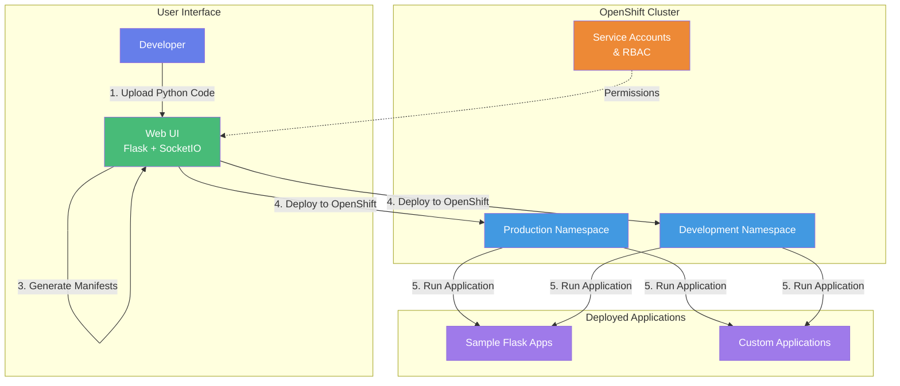
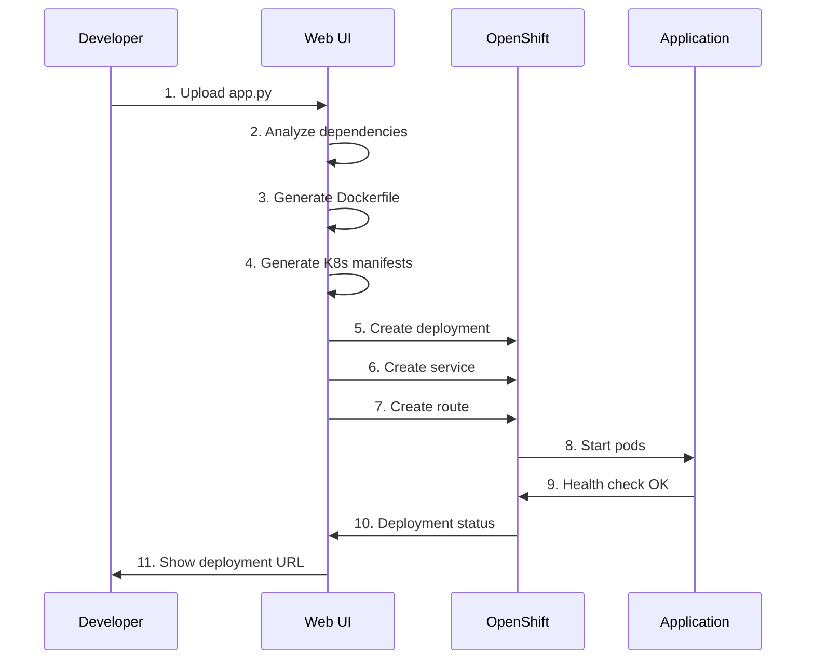

# Bob Deployment Platform - Workshop Guide

## Architecture Overview



## Project Structure

```
Module-5-Deployment-Platform/
├── 📄 DEMO-GUIDE.md                      # This file - Workshop guide
├── 📄 credentials.yaml.example           # Template for cluster credentials
│
├── 📂 k8s/                               # Infrastructure Kubernetes manifests
│   ├── 00-namespaces.yaml                # Production & Development namespaces
│   ├── 01-serviceaccount-rbac.yaml       # Service accounts & permissions
│   └── 02-secret.yaml.example            # Secret template for tokens
│
├── 📂 sample-app/                        # Sample Flask applications
│   ├── app.py                            # Simple Flask web app
│   └── system-dashboard.py               # System monitoring dashboard
│
└── 📂 web-ui/                            # Web UI - Visual deployment interface
    ├── app.py                            # Flask backend with SocketIO
    ├── deployment-templates/             # Deployment template files
    │   ├── buildconfig.yaml.template     # BuildConfig template
    │   ├── deployment.yaml.template      # Deployment template
    │   ├── Dockerfile.template           # Dockerfile template
    │   ├── Jenkinsfile.template          # Jenkins pipeline template
    │   ├── route.yaml.template           # Route template
    │   └── service.yaml.template         # Service template
    ├── k8s/                              # Web UI Kubernetes manifests
    │   ├── deployment-simple.yaml        # Web UI deployment
    │   ├── service.yaml                  # Web UI service
    │   └── route.yaml                    # Web UI external route
    ├── static/                           # Frontend assets
    │   ├── css/
    │   │   └── style.css                 # UI styling
    │   └── js/
    │       ├── app.js                    # Main JavaScript
    │       └── deploy.js                 # Deployment logic
    └── templates/                        # HTML templates
        ├── index.html                    # Main deployment page
        └── status.html                   # Deployment status page
```

## Deployment Flow



## Documentation

This guide contains all the information needed to deploy and use the Bob Deployment Platform. For additional resources, see the Additional Resources section at the end of this document.

## Workshop Overview

This workshop teaches you how to deploy Python applications to OpenShift using a Web UI that automates the deployment process by analyzing your code, generating deployment manifests, and deploying directly to OpenShift.

**What You'll Learn:**
- Deploy Python applications to OpenShift
- Use the Web UI for automated deployments
- Understand automatic dependency detection
- Manage Kubernetes resources
- Monitor deployment status in real-time

**Prerequisites:**
- Basic Python knowledge
- Basic understanding of containers
- OpenShift cluster access (provided by instructor)
- Terminal/command line familiarity

## Workshop Structure

### Part 1: Setup
- Install OpenShift CLI
- Connect to cluster
- Verify access

### Part 2: Infrastructure
- Create namespaces
- Configure service accounts
- Set up RBAC permissions
- Configure secrets

### Part 3: Web UI Deployment
- Deploy Web UI
- Access the interface
- Understand the deployment templates

### Part 4: Application Deployment
- Use Web UI to deploy applications
- Upload Python code
- Monitor deployment progress
- Access deployed applications

### Part 5: Hands-on Practice
- Deploy sample applications
- Customize configurations
- Debug common issues

## Quick Start

### Step 1: Install OpenShift CLI

Download and install the OpenShift CLI (`oc`) for your platform:

**Download from:** https://mirror.openshift.com/pub/openshift-v4/clients/ocp/stable/

- **macOS/Linux:** Extract and move to `/usr/local/bin/`
- **Windows:** Extract and add to PATH

Verify installation:
```bash
oc version
```

### Step 2: Configure Credentials

1. Get cluster credentials from instructor
2. Copy `credentials.yaml.example` to `credentials.yaml`
3. Fill in your cluster details:

```yaml
cluster:
  api_url: "https://api.your-cluster.example.com:6443"
  console_url: "https://console.your-cluster.example.com"
  username: "your-username"
  password: "your-password"
```

### Step 3: Login to Cluster

```bash
# Login using credentials
oc login <API_URL> -u <USERNAME> -p <PASSWORD>

# Verify connection
oc whoami
oc cluster-info
```

### Step 4: Deploy Infrastructure

```bash
# Create namespaces
oc apply -f k8s/00-namespaces.yaml

# Create service accounts and RBAC
oc apply -f k8s/01-serviceaccount-rbac.yaml

# Verify
oc get namespaces | grep -E "production|development"
oc get sa jenkins-sa -n production
```

### Step 5: Configure Secrets

```bash
# Get your OpenShift token
oc whoami -t

# Copy secret template
cp k8s/02-secret.yaml.example k8s/02-secret.yaml

# Edit and add your token
nano k8s/02-secret.yaml

# Apply secrets
oc apply -f k8s/02-secret.yaml
```

### Step 6: Deploy Web UI

```bash
# Create ConfigMaps
oc create configmap bob-web-ui-code \
  --from-file=app.py=web-ui/app.py \
  -n production

oc create configmap bob-web-ui-templates \
  --from-file=web-ui/templates/ \
  -n production

oc create configmap bob-web-ui-css \
  --from-file=style.css=web-ui/static/css/style.css \
  -n production

oc create configmap bob-web-ui-js \
  --from-file=app.js=web-ui/static/js/app.js \
  --from-file=deploy.js=web-ui/static/js/deploy.js \
  -n production

# Deploy Web UI
oc apply -f web-ui/k8s/

# Get Web UI URL
oc get route bob-web-ui -n production
```

## Workshop Exercises

### Exercise 1: Deploy Sample Application via Web UI

1. Open Web UI in browser (get URL from `oc get route bob-web-ui -n production`)
2. Fill in application details:
   - **App Name:** my-flask-app
   - **Namespace:** production
   - **Port:** 5000
3. Upload `sample-app/app.py`
4. Click "Deploy Application"
5. Monitor deployment progress in real-time
6. Access your deployed application via the provided route

### Exercise 2: Deploy System Dashboard

1. Open Web UI in browser
2. Fill in application details:
   - **App Name:** system-dashboard
   - **Namespace:** development
   - **Port:** 8080
3. Upload `sample-app/system-dashboard.py`
4. Click "Deploy Application"
5. Monitor deployment and access the dashboard

## Useful Commands

### Check Deployment Status
```bash
# List all pods
oc get pods -n production

# Check pod logs
oc logs <pod-name> -n production

# Describe pod
oc describe pod <pod-name> -n production

# Check deployments
oc get deployments -n production

# Check routes
oc get routes -n production
```

### Debug Issues
```bash
# Execute command in pod
oc exec -it <pod-name> -n production -- /bin/bash

# Port forward for local testing
oc port-forward <pod-name> 8080:8080 -n production

# View events
oc get events -n production --sort-by='.lastTimestamp'

# Check resource usage
oc top pods -n production
```

### Cleanup
```bash
# Delete specific deployment
oc delete deployment <name> -n production

# Delete all resources in namespace
oc delete all --all -n production

# Delete namespace
oc delete namespace production
```

## Additional Resources

### Documentation
- [OpenShift Documentation](https://docs.openshift.com/)
- [Kubernetes Documentation](https://kubernetes.io/docs/)
- [Flask Documentation](https://flask.palletsprojects.com/)

### Sample Applications
- `sample-app/app.py` - Basic Flask web application
- `sample-app/system-dashboard.py` - System monitoring dashboard application
