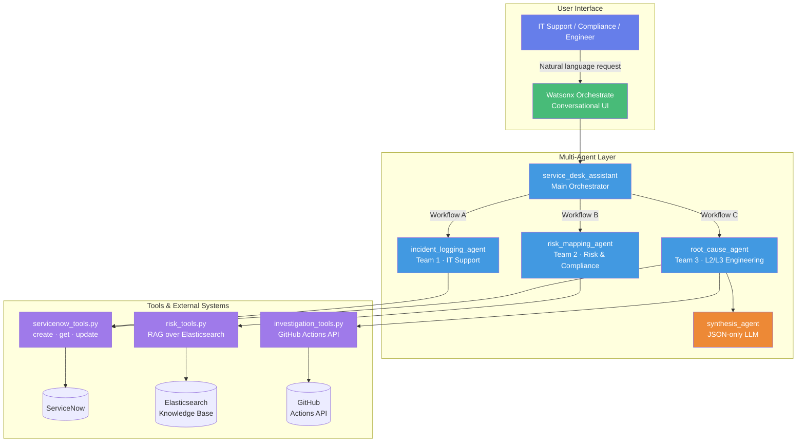
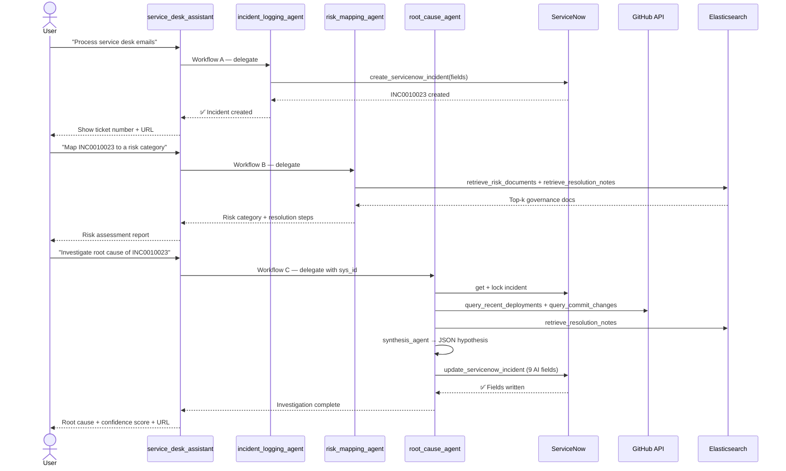

# Service Desk Assistant — Workshop Demo Guide

> **AI-Powered Service Desk Automation with IBM Watsonx Orchestrate**  
> **Stack:** IBM Watsonx Orchestrate · ServiceNow · GitHub · Elasticsearch  
> **Approach:** Multi-agent orchestration with autonomous root-cause investigation

---

## Architecture Overview



---

## Project Structure

```
Service_desk_Assistant_T3/
├── 📄 DEMO-GUIDE.md                       # This file — Workshop demo guide
├── 📄 README.md                           # Project overview & quick start
├── 📄 COMPLETE_GUIDE.md                   # Full implementation reference
├── 📄 WORKFLOW.md                         # End-to-end workflow documentation
├── 📄 .env.example                        # Template for all credentials
├── 📄 import_to_orchestrate.sh            # One-shot import: connections + tools + agents
├── 📄 run_investigation.py                # Hybrid Python runner for root-cause investigation
├── 📄 test_connections.py                 # Verify all external connections before deployment
├── 📄 test_local_tools.py                 # 21 integration assertions (no WXO needed)
│
├── 📂 agents/                             # Agent YAML definitions and Python tools
│   ├── service_desk_assistant.yml         # Main orchestrator (3 teams, auto-trigger)
│   ├── incident_logging_agent.yml         # Workflow A: email → ServiceNow incident
│   ├── risk_mapping_agent.yml             # Workflow B: incident → risk category
│   ├── root_cause_agent.yml               # Workflow C: 7-step investigation protocol
│   ├── synthesis_agent.yml                # Step 5 only: JSON-only LLM hypothesis
│   ├── servicenow_tools.py                # create / get / update + idempotency guard
│   ├── investigation_tools.py             # GitHub Actions + Commits APIs
│   └── risk_tools.py                      # Elasticsearch hybrid RAG tools
│
├── 📂 connections/                        # Watsonx Orchestrate connection definitions
│   ├── servicenow-service-desk.yaml
│   ├── github-service-desk.yaml
│   ├── elasticsearch-service-desk.yaml
│   └── watsonx-ai-service-desk.yaml
│
├── 📂 ingestion/                          # Data ingestion scripts
│   ├── create_indices.py                  # Create Elasticsearch indices
│   ├── ingest_risk_docs.py                # Load risk governance documents
│   ├── ingest_resolution_notes.py         # Load past incident resolutions
│   └── ingest_deployments.py              # Index GitHub Actions sample data
│
├── 📂 data/                               # Sample data (JSON format)
│   ├── risk_docs/
│   │   └── sample_risk_documents.json
│   ├── resolution_notes/
│   │   └── sample_servicedesk_notes.json
│   └── deployments/
│       └── sample_deployments.json        # 8 GitHub Actions run records
│
├── 📂 guardrails/                         # PII detection plugins
│   ├── guardrails_input.py                # Pre-invoke PII enforcement
│   ├── guardrails_output.py               # Post-invoke PII enforcement
│   └── test_texts.py                      # 10 PII + 10 non-PII test cases
│
└── 📂 lab_exports/                        # Pre-built Watsonx Orchestrate export packages
    ├── Service_Desk_Agent_Example/         # Full service desk agent export
    ├── risk_mapping_agent/                 # Risk mapping agent export
    └── root_cause_agent/                   # Full export package (agent + tools + connections)
```

---

## Workflow Overview



---

## Documentation

This guide contains all the information needed to set up and demo the Service Desk Assistant. For deeper reference material, see:

- **[README.md](./README.md)** — Project overview, architecture, connections setup
- **[COMPLETE_GUIDE.md](./COMPLETE_GUIDE.md)** — Full implementation guide (ADK install, ServiceNow config, tools & agents reference, troubleshooting)
- **[WORKFLOW.md](./WORKFLOW.md)** — Detailed workflow diagrams, distributed correctness properties, investigation pipeline

---

## Workshop Overview

This workshop demonstrates how to build an AI-powered service desk automation system using IBM Watsonx Orchestrate. The assistant handles three real-world IT workflows with no human triage required.

**What You'll Learn:**
- Build and deploy multi-agent systems with IBM Watsonx Orchestrate ADK
- Connect AI agents to external systems (ServiceNow, GitHub, Elasticsearch)
- Implement RAG (Retrieval-Augmented Generation) for knowledge-based recommendations
- Design hybrid Python + LLM pipelines for reliable autonomous investigation
- Apply distributed correctness patterns (idempotency, leader election, graceful degradation)

**Prerequisites:**
- Python 3.11+ installed
- Basic Python knowledge
- IBM Watsonx Orchestrate instance (provided by instructor)
- ServiceNow developer instance (provided by instructor)
- Terminal/command line familiarity

---

## Workshop Structure

### Part 1: Setup
- Install the Watsonx Orchestrate ADK
- Configure environment credentials
- Verify all connections

### Part 2: Data Ingestion
- Create Elasticsearch indices
- Ingest risk governance documents
- Ingest past incident resolution notes

### Part 3: Import Agents & Tools
- Import connections to Watsonx Orchestrate
- Import all tools (Python `@tool` decorator)
- Import all agent YAML definitions

### Part 4: Workflow A — Email to Incident
- Trigger `incident_logging_agent` via chat
- Watch email parsed → structured ticket created in ServiceNow
- Observe auto-suggest for root-cause investigation on Critical/High incidents

### Part 5: Workflow B — Risk Mapping
- Trigger `risk_mapping_agent` with an incident ID
- View RAG results from Elasticsearch (governance docs + past resolutions)
- Review risk category, severity, and recommended resolution

### Part 6: Workflow C — Root-Cause Investigation
- Run `run_investigation.py` locally for the full 7-step pipeline
- Watch evidence gathered from GitHub Actions API
- View LLM-synthesised hypothesis written to ServiceNow AI fields

### Part 7: Hands-on Practice
- Run the full end-to-end flow on a sample incident
- Inspect ServiceNow AI fields after investigation
- Review graceful degradation behaviour when sources are unavailable

---

## Quick Start

### Step 1: Install the Watsonx Orchestrate ADK

Python 3.11+ is required.

```bash
# Verify Python version
python --version

# Install the ADK
pip install --upgrade ibm-watsonx-orchestrate
```

Or using `uv`:

```bash
uv add ibm-watsonx-orchestrate
```

Then register and activate your environment:

```bash
orchestrate env add -n servicedesk_assistant -u <your-wxo-service-instance-url>
orchestrate env activate servicedesk_assistant
```

> Full ADK installation guide: https://developer.watson-orchestrate.ibm.com/getting_started/installing

---

### Step 2: Configure Credentials

```bash
cp .env.example .env
```

Open `.env` and fill in every value using the credentials provided by your instructor. The template documents every variable with a comment. The required groups are:

- **Elasticsearch** — `ES_HOST`, `ES_PORT`, `ES_USERNAME`, `ES_PASSWORD`
- **Watsonx Orchestrate** — `WATSONX_ORCHESTRATE_URL`, `WXO_APIKEY`
- **watsonx.ai** — `WATSONX_URL`, `WATSONX_APIKEY`, `WATSONX_PROJECT_ID`
- **ServiceNow** — `SNOW_INSTANCE_URL`, `SNOW_USERNAME`, `SNOW_PASSWORD`
- **GitHub** — `GITHUB_TOKEN`, `GITHUB_REPO_OWNER`, `GITHUB_REPO_NAME`
- **Investigation runner** — `INVESTIGATION_DEFAULT_SYS_ID`, `SYNTHESIS_AGENT_ID`

> All instances (Watsonx Orchestrate, Watsonx Discovery, ServiceNow) are provided by your instructor. You do not need to provision anything.

---

### Step 3: Install Python Dependencies

```bash
# Using uv (recommended)
uv venv
source .venv/bin/activate
uv pip install -r requirements.txt

# Using pip
python -m venv .venv
source .venv/bin/activate
pip install -r requirements.txt
```

---

### Step 4: Verify Connections

```bash
python test_connections.py
```

Expected output confirms connectivity to Elasticsearch, ServiceNow, and (optionally) GitHub.

---

### Step 5: Ingest Data

```bash
# Create Elasticsearch indices for risk docs, resolution notes, and deployments
python ingestion/create_indices.py

# Load sample data
python ingestion/ingest_risk_docs.py
python ingestion/ingest_resolution_notes.py
python ingestion/ingest_deployments.py
```

---

### Step 6: Import Everything to Watsonx Orchestrate

```bash
chmod +x import_to_orchestrate.sh
bash import_to_orchestrate.sh
```

The script reads your `.env`, activates the WXO environment, and imports in sequence:

1. 4 connections (`servicenow-service-desk`, `github-service-desk`, `elasticsearch-service-desk`, `watsonx-ai-service-desk`)
2. 7 tools from `servicenow_tools.py`, `risk_tools.py`, `investigation_tools.py`
3. 5 agent YAML definitions

---

## Workshop Exercises

### Exercise 1: Workflow A — Process a Service Desk Email

1. Open Watsonx Orchestrate and start a conversation with `service_desk_assistant`
2. Say: **"I need help processing service desk emails"**
3. Paste the following sample email when prompted:

   ```
   From: john.doe@company.com
   Subject: Cannot access VPN

   Hi support team, I've been unable to connect to the company VPN since this morning.
   I'm getting a timeout error. This is blocking all my work. Please help urgently.
   ```

4. Watch the agent extract fields and create a ServiceNow incident
5. Note the returned ticket number (e.g. `INC0010023`) and the incident URL
6. If urgency is Critical (1) or High (2), accept the offer to launch a root-cause investigation

---

### Exercise 2: Workflow B — Map an Incident to a Risk Category

1. In the same conversation, say: **"Map INC0010023 to a risk category"**
2. The `risk_mapping_agent` will perform hybrid search over Elasticsearch
3. Review the response:
   - Risk category and severity level
   - Relevant governance documents surfaced by RAG
   - Recommended resolution steps from past incidents

---

### Exercise 3: Workflow C — Run a Root-Cause Investigation

Run the hybrid Python investigation pipeline locally against a real ServiceNow incident:

```bash
# Run on the default demo incident (INC0000060)
source .venv/bin/activate
python3 run_investigation.py

# Or target a specific incident by sys_id
python3 run_investigation.py <sys_id>
```

Watch the 7-step pipeline execute in your terminal:

```
════════════════════════════════════════════════════════════
  🚀 ROOT-CAUSE INVESTIGATION
────────────────────────────────────────────────────────────
  Incident sys_id: 1c741bd70b2322007518478d83673af3

  STEP 1 — Read incident         ✅ INC0000060 — Unable to connect to email
  STEP 2 — Acquire lock          ✅ Lock acquired: root_cause_agent:LOCKED
  STEP 4 — Gather evidence       ✅ Deployments: 0 runs in ±2h window
  STEP 5 — Synthesise hypothesis ✅ Hypothesis parsed from LLM response
  STEP 6 — Write to ServiceNow   ✅ INC0000060 updated
  STEP 7 — Verify fields         ✅ 6/7 AI fields written

  ✅ INVESTIGATION COMPLETE
  Incident URL: https://your-instance.service-now.com/...
════════════════════════════════════════════════════════════
```

After the run, open the ServiceNow incident and inspect the 9 `u_ai_*` fields written by the pipeline.

---

## Useful Commands

### Verify Connections

```bash
# Test all external connections (ES, ServiceNow, GitHub)
python test_connections.py

# Run full tool-level integration tests (21 assertions, ~15s, no WXO needed)
python3 test_local_tools.py
```

### Watsonx Orchestrate CLI

```bash
# List imported tools
orchestrate tools list

# List imported agents
orchestrate agents list

# Import a single connection
orchestrate connections import -f connections/servicenow-service-desk.yaml

# Set credentials for a connection
orchestrate connections set-credentials -a servicenow-service-desk \
  --env draft \
  -e 'SNOW_INSTANCE_URL=https://your-instance.service-now.com' \
  -e 'SNOW_USERNAME=your-username' \
  -e 'SNOW_PASSWORD=your-password'
```

### ServiceNow — Check AI Fields

After running an investigation, verify the 9 AI-enriched fields were written:

```bash
# Quick field check via the test script
python3 test_local_tools.py
```

Or open the ServiceNow incident directly and scroll to the AI Investigation section.

### Run Guardrails Tests

```bash
cd guardrails
python guardrails_input.py    # Test input PII detection
python guardrails_output.py   # Test output PII detection
python test_texts.py          # 20 test cases (10 PII + 10 clean)
```

---

## Technology Stack

| Component | Technology |
|---|---|
| **Orchestration** | IBM Watsonx Orchestrate (ADK) |
| **LLM** | `gpt-oss-120b` via Watsonx |
| **Knowledge Base** | Elasticsearch 8.x (Watsonx Discovery) |
| **Dense Embeddings** | `intfloat/multilingual-e5-large` |
| **Sparse Embeddings** | ELSER (`.elser_model_2_linux-x86_64`) |
| **ITSM** | ServiceNow |
| **CI/CD Source** | GitHub Actions API |
| **Email** | Gmail IMAP |
| **Guardrails** | IBM Watson OpenScale |

---

## Additional Resources

### Documentation
- [IBM Watsonx Orchestrate ADK Docs](https://developer.watson-orchestrate.ibm.com)
- [ServiceNow Developer Docs](https://developer.servicenow.com)
- [Elasticsearch Docs](https://www.elastic.co/guide/en/elasticsearch/reference/current/index.html)

### Reference Guides (this repo)
- [`COMPLETE_GUIDE.md`](./COMPLETE_GUIDE.md) — Full implementation guide (ServiceNow config, tools & agents reference, production deployment)
- [`WORKFLOW.md`](./WORKFLOW.md) — Detailed workflow diagrams and distributed correctness properties
- [`Email_to_Incident_UI_Setup_Guide.md`](./Email_to_Incident_UI_Setup_Guide.md) — No-code/low-code Email-to-Incident setup via Watsonx Orchestrate UI
- [`service_now_dev_instance_setup.md`](./service_now_dev_instance_setup.md) — ServiceNow developer instance setup

### Lab Export Packages
Pre-built Watsonx Orchestrate packages are available in [`lab_exports/`](./lab_exports/) — use these if you want to import a fully configured agent without building from scratch:

- `lab_exports/Service_Desk_Agent_Example/` — Full service desk agent export
- `lab_exports/risk_mapping_agent/` — Risk mapping agent export
- `lab_exports/root_cause_agent/` — Full root-cause investigation package (agent + tools + connections)
