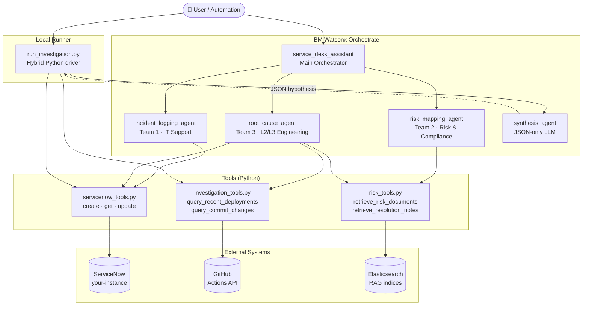
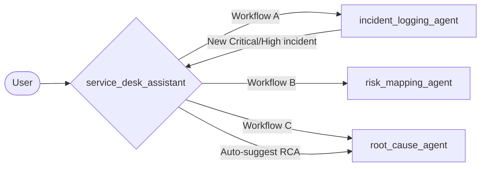
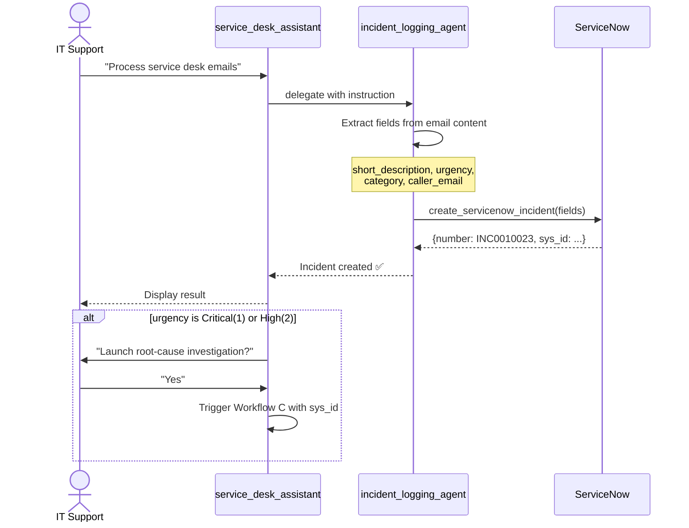
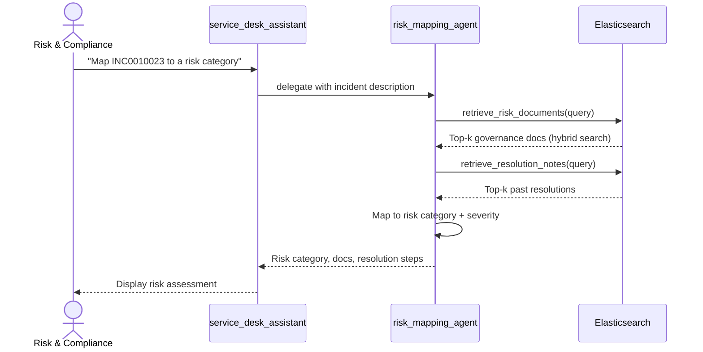
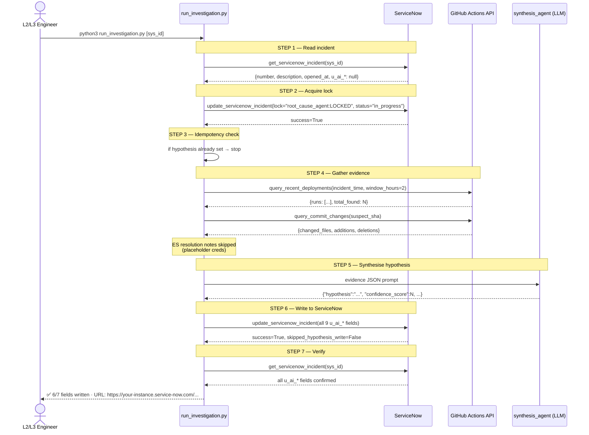
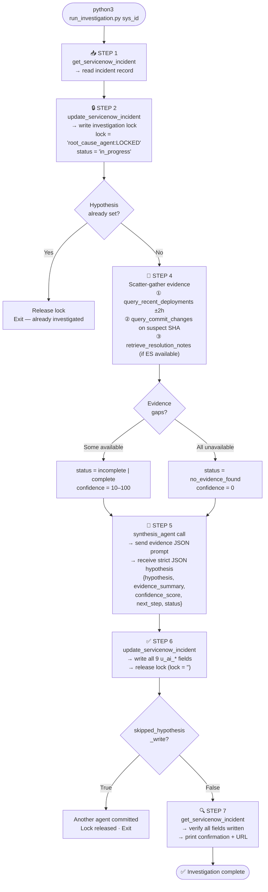
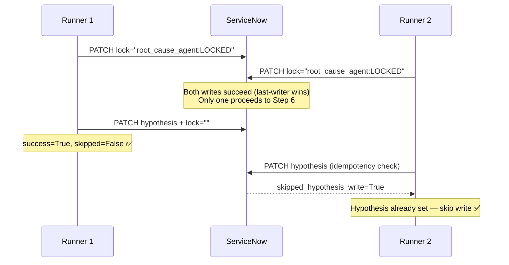
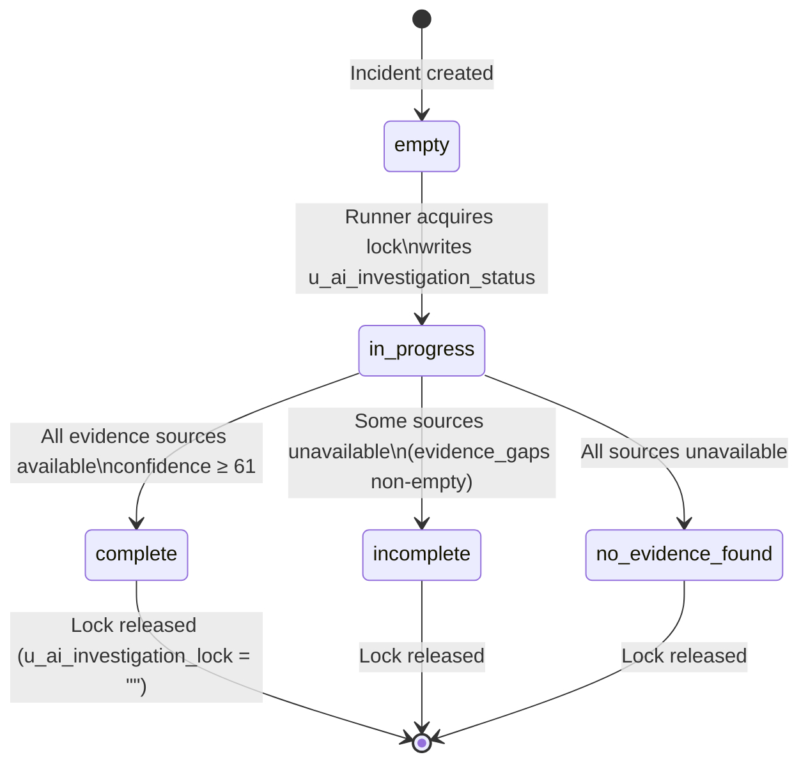
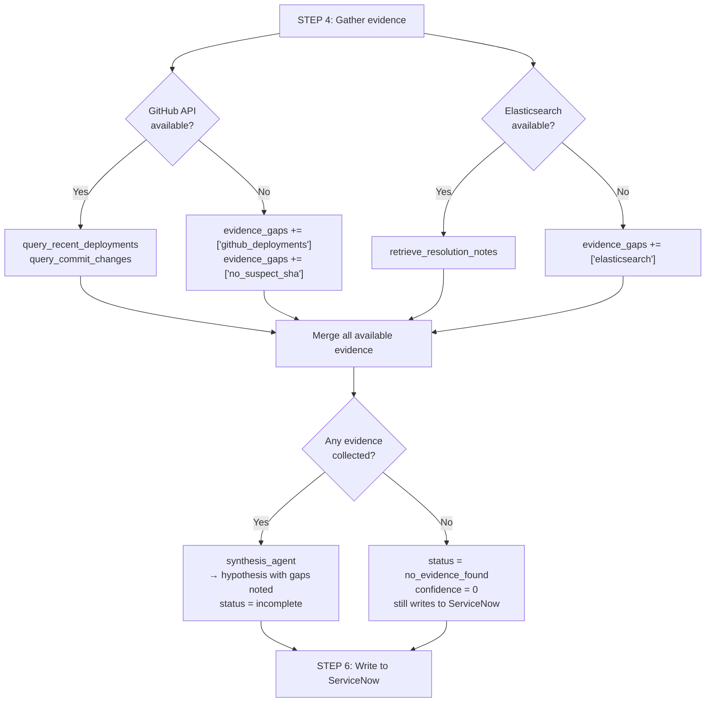

# Service Desk Assistant — Complete Workflow Guide

> **Stack:** IBM Watsonx Orchestrate · ServiceNow · GitHub · Elasticsearch (optional)  
> **Approach:** Multi-agent orchestration with autonomous root-cause investigation

---

## Table of Contents

1. [System Overview](#1-system-overview)
2. [Architecture](#2-architecture)
3. [Agents](#3-agents)
4. [Tools](#4-tools)
5. [Connections](#5-connections)
6. [Workflow A — Email to Incident](#6-workflow-a--email-to-incident)
7. [Workflow B — Risk Mapping](#7-workflow-b--risk-mapping)
8. [Workflow C — Root-Cause Investigation](#8-workflow-c--root-cause-investigation)
9. [Investigation Pipeline in Detail](#9-investigation-pipeline-in-detail)
10. [Distributed Correctness Properties](#10-distributed-correctness-properties)
11. [ServiceNow AI Fields](#11-servicenow-ai-fields)
12. [Running the Investigation](#12-running-the-investigation)
13. [Graceful Degradation](#13-graceful-degradation)
14. [File Map](#14-file-map)

---

## 1. System Overview

The Service Desk Assistant automates three IT workflows that previously required human triage:

| Workflow | Trigger | Output |
|---|---|---|
| **A — Incident Logging** | Unread email in service desk inbox | ServiceNow incident ticket |
| **B — Risk Mapping** | Existing incident ID or description | Risk category + governance docs |
| **C — Root-Cause Investigation** | ServiceNow incident `sys_id` (Critical or High) | 9 AI-enriched fields written to the ticket |

A single conversational entry point — `service_desk_assistant` — routes users to the right workflow.

---

## 2. Architecture

### High-level system map



### Multi-agent routing



---

## 3. Agents

### `service_desk_assistant`
**Role:** Main orchestrator and conversational entry point.  
**Collaborators:** `incident_logging_agent`, `risk_mapping_agent`, `root_cause_agent`  
**Tools:** `get_servicenow_incident`

Routes users to one of three workflows. After `incident_logging_agent` creates a Critical (1) or High (2) urgency incident, it proactively offers to launch a root-cause investigation.

---

### `incident_logging_agent`
**Role:** Processes service desk emails and creates structured ServiceNow tickets.  
**Tools:** `create_servicenow_incident`

Extracts `short_description`, `description`, `caller_email`, `urgency` (1–4), and `category` from free-text email content. Validates all fields before writing. Never creates a ticket for invalid input.

---

### `risk_mapping_agent`
**Role:** Maps an incident to a risk category using RAG over governance documents.  
**Tools:** `retrieve_risk_documents`, `retrieve_resolution_notes`

Performs hybrid dense + sparse Elasticsearch search to surface relevant governance docs and past resolutions. Returns a risk category, severity, and recommended resolution.

---

### `root_cause_agent`
**Role:** Autonomous 7-step investigation agent. Given a `sys_id`, gathers evidence from GitHub and Elasticsearch, synthesises a hypothesis, and writes it to ServiceNow exactly once.  
**Tools:** `query_recent_deployments`, `query_commit_changes`, `retrieve_resolution_notes`, `get_servicenow_incident`, `update_servicenow_incident`

> **Note:** In practice, the cloud LLM (`gpt-oss-120b`) hits a per-turn tool-call budget before completing all 7 steps. The hybrid runner `run_investigation.py` is the production-grade way to run a complete investigation — it drives Steps 1, 2, 4, 6, and 7 in Python and delegates only Step 5 (synthesis) to `synthesis_agent`.

---

### `synthesis_agent`
**Role:** Single-purpose JSON-only LLM agent. Receives a structured evidence block and returns a strict JSON hypothesis object.  
**Tools:** _(none)_

No multi-step protocol. Responds with exactly one JSON object — no markdown, no preamble, no tool calls. Consumed programmatically by `run_investigation.py`.

---

## 4. Tools

### ServiceNow tools — `agents/servicenow_tools.py`

| Tool | Description |
|---|---|
| `create_servicenow_incident` | Creates a new incident record with standard + AI fields |
| `get_servicenow_incident` | Reads an incident by `ticket_number` OR `sys_id`; returns all 9 `u_ai_*` fields |
| `update_servicenow_incident` | PATCHes an incident; enforces **idempotency** on `u_ai_root_cause_hypothesis` (will not overwrite if already set) |

**Connection:** `servicenow-service-desk` (key-value: `SNOW_INSTANCE_URL`, `SNOW_USERNAME`, `SNOW_PASSWORD`)

---

### Risk & RAG tools — `agents/risk_tools.py`

| Tool | Description |
|---|---|
| `retrieve_risk_documents` | Hybrid semantic + sparse (ELSER) search over `risk_mapping_hybrid_index` |
| `retrieve_resolution_notes` | Hybrid search over `resolution_notes_hybrid_index` for past resolutions |

**Connection:** `elasticsearch-service-desk` + `watsonx-ai-service-desk`  
**Embeddings:** `intfloat/multilingual-e5-large` (dense) + `.elser_model_2_linux-x86_64` (sparse)

---

### GitHub investigation tools — `agents/investigation_tools.py`

| Tool | Description |
|---|---|
| `query_recent_deployments` | Lists GitHub Actions runs within ±N hours of an incident timestamp |
| `query_commit_changes` | Returns changed files, diff summary, author, and timestamp for a commit SHA |

Both tools follow the **graceful-degradation contract**: always return `{"status": "ok"|"unavailable", ...}` — never raise on external failure.

**Connection:** `github-service-desk` (key-value: `GITHUB_TOKEN`, `GITHUB_REPO_OWNER`, `GITHUB_REPO_NAME`)

---

## 5. Connections

| Connection name | Type | Variables | Used by |
|---|---|---|---|
| `servicenow-service-desk` | key_value | `SNOW_INSTANCE_URL`, `SNOW_USERNAME`, `SNOW_PASSWORD` | servicenow_tools |
| `github-service-desk` | key_value | `GITHUB_TOKEN`, `GITHUB_REPO_OWNER`, `GITHUB_REPO_NAME` | investigation_tools |
| `elasticsearch-service-desk` | key_value | `ES_HOST`, `ES_PORT`, `ES_USERNAME`, `ES_PASSWORD`, `ES_USE_SSL`, `ES_VERIFY_CERTS`, `ES_CERT_CONTENT` | risk_tools |
| `watsonx-ai-service-desk` | key_value | `WATSONX_URL`, `WATSONX_APIKEY`, `WATSONX_PROJECT_ID` | risk_tools (embeddings) |

All connections are registered in Watsonx Orchestrate for both `draft` and `live` environments via `import_to_orchestrate.sh`.

---

## 6. Workflow A — Email to Incident



**Entry point:** `service_desk_assistant` → delegates to `incident_logging_agent`  
**Output:** ServiceNow ticket with number, URL, extracted fields  
**Auto-trigger:** If urgency ≤ 2, orchestrator offers to start root-cause investigation

---

## 7. Workflow B — Risk Mapping



**Entry point:** `service_desk_assistant` → delegates to `risk_mapping_agent`  
**Output:** Risk category, relevant governance documents, recommended resolution

---

## 8. Workflow C — Root-Cause Investigation



---

## 9. Investigation Pipeline in Detail

The investigation is a **hybrid Python + LLM pipeline**. Python handles all deterministic steps; the LLM only reasons over pre-gathered, pre-formatted evidence.



### Step responsibilities

| Step | Who | What |
|---|---|---|
| 1 | Python | Read incident from ServiceNow |
| 2 | Python | Write investigation lock (idempotent, always succeeds) |
| 3 | Python | Check if hypothesis already set — exit if yes |
| 4 | Python | Call GitHub Actions API + commit API directly |
| 5 | **LLM** (`synthesis_agent`) | Reason over evidence → return JSON hypothesis |
| 6 | Python | PATCH all 9 `u_ai_*` fields + release lock |
| 7 | Python | Read-back verify + print URL |

---

## 10. Distributed Correctness Properties

### Investigation lock (leader election)

Before gathering evidence, the runner writes `u_ai_investigation_lock = "root_cause_agent:LOCKED"` to the ServiceNow incident. This prevents two concurrent runners from both writing a hypothesis.



### Idempotency (exactly-once write)

`update_servicenow_incident` reads the current value of `u_ai_root_cause_hypothesis` before every hypothesis write. If it is already non-empty, the tool:
- Returns `skipped_hypothesis_write = True`
- Skips all 7 content fields
- Still allows lock and status fields through

This guarantees the hypothesis is written **at most once**, even if the runner is called multiple times for the same incident.

### Graceful degradation

Every tool returns `{"status": "ok" | "unavailable", ...}` and never raises. If a source is down:

| Source unavailable | Effect |
|---|---|
| GitHub API | `evidence_gaps = ["github_deployments"]` — investigation continues with ES only |
| Elasticsearch | `evidence_gaps = ["elasticsearch"]` — investigation continues with GitHub only |
| Both | `investigation_status = "no_evidence_found"`, `confidence_score = 0` — still writes to ServiceNow |
| ServiceNow write fails | Retry up to 3× — lock left in place if all retries fail |

---

## 11. ServiceNow AI Fields

All 9 fields are on the `incident` table, created via REST API (`sys_dictionary`):

| Field name | Type | Purpose |
|---|---|---|
| `u_ai_root_cause_hypothesis` | `string` | 2–4 sentence plain-English root cause |
| `u_ai_evidence_summary` | `string` | Bullet list of every evidence source used |
| `u_ai_suspect_commit` | `string` | GitHub commit SHA implicated in the incident |
| `u_ai_suspect_deployment` | `string` | GitHub Actions run ID implicated |
| `u_ai_confidence_score` | `string` | Integer 0–100; 0–30 weak, 31–60 moderate, 61–100 strong |
| `u_ai_recommended_next_step` | `string` | One concrete action for the L2/L3 engineer |
| `u_ai_evidence_gaps` | `string` | JSON array of unavailable source names |
| `u_ai_investigation_lock` | `string` | `"root_cause_agent:LOCKED"` when active, `""` when released |
| `u_ai_investigation_status` | `string` | `in_progress` → `complete` / `incomplete` / `no_evidence_found` |

### Field lifecycle



---

## 12. Running the Investigation

### Prerequisites

```bash
# 1. Activate Watsonx Orchestrate environment (once per ~1 hour session)
WXO_APIKEY=$(grep "^WXO_APIKEY=" .env | cut -d'=' -f2-)
orchestrate env activate servicedesk_assistant --api-key "$WXO_APIKEY"
```

### Run on default incident (INC0000060)

```bash
/Library/Frameworks/Python.framework/Versions/3.12/bin/python3 run_investigation.py
```

### Run on a specific incident

```bash
/Library/Frameworks/Python.framework/Versions/3.12/bin/python3 run_investigation.py <sys_id>

# Example (replace with your incident sys_id from ServiceNow):
/Library/Frameworks/Python.framework/Versions/3.12/bin/python3 run_investigation.py <your-incident-sys-id>
```

### Expected output

```
════════════════════════════════════════════════════════════
  🚀 ROOT-CAUSE INVESTIGATION
────────────────────────────────────────────────────────────
  Incident sys_id: 1c741bd70b2322007518478d83673af3
  Time:            2026-07-09T13:29:24Z

════════════════════════════════════════════════════════════
  STEP 1 — Read incident
────────────────────────────────────────────────────────────
  ✅ INC0000060 — Unable to connect to email
     Opened: 2016-12-12 15:19:57  Urgency: 2

════════════════════════════════════════════════════════════
  STEP 2 — Acquire investigation lock
────────────────────────────────────────────────────────────
  ✅ Lock acquired: root_cause_agent:LOCKED

════════════════════════════════════════════════════════════
  STEP 4 — Gather evidence
────────────────────────────────────────────────────────────
  ✅ Deployments: 0 runs in ±2h window
  ⚠️  No deployment runs found in time window
  ⚠️  Resolution notes: ES not configured — skipping
  Evidence gaps: ['no_suspect_sha', 'elasticsearch']

════════════════════════════════════════════════════════════
  STEP 5 — Synthesise hypothesis (LLM)
────────────────────────────────────────────────────────────
  → Calling synthesis_agent...
  ✅ Hypothesis parsed from LLM response

════════════════════════════════════════════════════════════
  🧠 HYPOTHESIS
  The email connectivity issue likely stems from an
  external factor such as the email server being down
  or network problems, as no recent code changes were found.
  Confidence: 10/100  Status: no_evidence_found

════════════════════════════════════════════════════════════
  STEP 6 — Write to ServiceNow
────────────────────────────────────────────────────────────
  ✅ ServiceNow updated: INC0000060

════════════════════════════════════════════════════════════
  STEP 7 — Verify ServiceNow fields
────────────────────────────────────────────────────────────
  ✅ u_ai_root_cause_hypothesis
  ✅ u_ai_evidence_summary
  ✅ u_ai_confidence_score
  ✅ u_ai_recommended_next_step
  ✅ u_ai_evidence_gaps
  ✅ u_ai_investigation_status
  ⬜ u_ai_investigation_lock: (empty — lock released)

════════════════════════════════════════════════════════════
  ✅ INVESTIGATION COMPLETE  6/7 fields written
  Incident URL: https://your-instance.service-now.com/...
```

### Local unit tests

```bash
# Run all tool-level tests (21 assertions, ~15s)
source .venv/bin/activate
python3 test_local_tools.py
```

### Import all agents and tools to WXO

```bash
bash import_to_orchestrate.sh
```

---

## 13. Graceful Degradation



The pipeline **always completes** — it never crashes on external failure. In the worst case (all sources down), it writes `status = no_evidence_found` with `confidence_score = 0` so the engineer knows the investigation ran but found nothing.

---

## 14. File Map

```
Service_desk_Assistant_T3/
│
├── .env                          # Real credentials (git-ignored)
├── .env.example                  # Template with all required keys
├── import_to_orchestrate.sh      # One-shot: connections + tools + agents → WXO
├── run_investigation.py          # Hybrid runner: Python steps 1,2,4,6,7 + LLM step 5
├── test_local_tools.py           # 21 integration assertions (no WXO needed)
├── test_connections.py           # Original connection + scenario tests
├── requirements.txt              # Full Python deps
├── requirements_tools.txt        # Minimal deps for WXO tool deployment
│
├── agents/
│   ├── service_desk_assistant.yml  # Main orchestrator (3 teams, auto-trigger)
│   ├── incident_logging_agent.yml  # Workflow A: email → incident
│   ├── risk_mapping_agent.yml      # Workflow B: incident → risk category
│   ├── root_cause_agent.yml        # Workflow C: 7-step investigation protocol
│   ├── synthesis_agent.yml         # Step 5 only: JSON-only LLM hypothesis
│   ├── servicenow_tools.py         # create / get / update + idempotency
│   ├── investigation_tools.py      # GitHub Actions + Commits APIs
│   └── risk_tools.py               # ES hybrid RAG tools
│
├── connections/
│   ├── servicenow-service-desk.yaml
│   ├── github-service-desk.yaml
│   ├── elasticsearch-service-desk.yaml
│   └── watsonx-ai-service-desk.yaml
│
├── ingestion/
│   ├── create_indices.py           # Create ES indices (risk, resolution, deployments)
│   ├── ingest_risk_docs.py
│   ├── ingest_resolution_notes.py
│   └── ingest_deployments.py       # Index GitHub Actions sample data
│
├── data/
│   ├── risk_docs/sample_risk_documents.json
│   ├── resolution_notes/sample_servicedesk_notes.json
│   └── deployments/sample_deployments.json   # 8 GitHub Actions run records
│
├── guardrails/
│   ├── guardrails_input.py         # Pre-invoke PII detection
│   ├── guardrails_output.py        # Post-invoke PII detection
│   └── test_texts.py
│
└── lab_exports/
    ├── Service_Desk_Agent_Example/ # Original T3 WXO export
    ├── risk_mapping_agent/
    └── root_cause_agent/           # Full export package (agent + tools + connections)
```